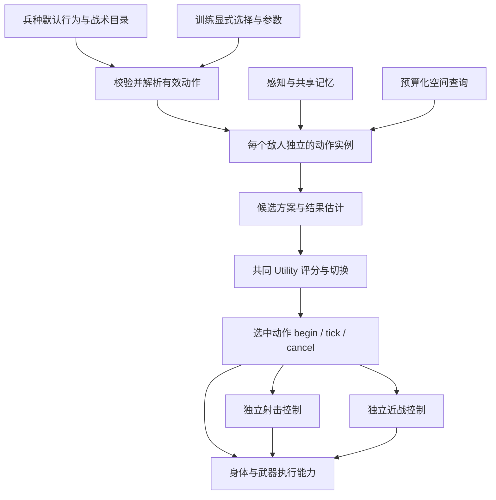

# 敌人 AI：代码结构、维护与使用部署

本次实现对应 `superpowers/specs/2026-09-28-enemy-modular-ai-design.md`。当前主场景使用独立动作模块和统一 Utility 评分，不再由 AI 主循环按具体战术 ID 分派执行。

文中 `res://` 相对于 `movement_demo/project.godot`，不是仓库根目录。先看“在 Godot 中配置敌人”进行调参；新增动作看“添加动作或新兵种”和“维护协议”；放进新地图看“接入与部署”。完整文件分类见 [项目目录](project-layout.md)。

## 在 Godot 中配置敌人

1. 打开 `movement_demo/scenes/arena.tscn`，选择 `Enemy/UnitType`。敌人已是独立场景实例；如需展开子节点，右键 Enemy 启用“可编辑子节点”。主场景中的路径仍为 `Arena/Enemy/UnitType`。
2. `profile` 是可保存、复制和复用的 `EnemyUnitProfile` 资源。现成模板位于 `resources/enemy/units/ranged.tres` 和 `resources/enemy/units/melee.tres`。
3. 展开兵种资源，可以分别配置“默认行为”和“战术动作”。默认行为仍是独立模块；模板只是预先填好的组合。
4. 选择同一敌人的 `Training`，其 `profile` 是可复用的 `EnemyTrainingProfile`。检查器上方的“战术解锁”由当前兵种的战术目录生成。
5. 训练参数在 `profile` 内分组保存。开火反应时间位于 `tactics.fire_reaction_seconds`；它是训练参数，射击服务只读取该值并记录当前敌人的计时进度。

检查器插件为 `addons/enemy_training_inspector`，已在项目中启用。若编辑器在修改代码时一直开着，重新打开项目以加载新资源类型和插件。

默认行为不在训练中重复勾选；要移除搜索或换弹模块，应修改兵种的默认行为列表。训练仍可调整这些模块的训练参数。

选择“出口压制”会自动包含“普通压制”；选择“掩护撤离”或近战“掩体接近”会自动包含“掩体躲藏与探头”。自动包含项显示为勾选且锁定，并注明来源。高级项与基础项都有独立实例与候选，不会因为高级项启用就排除基础项，也不因继承关系获得评分优先权。原有手动选择保留，取消高级项时不会误删手动启用的基础项。

更换兵种后，旧兵种独有的显式选择保存在训练资源里，但隐藏且不装配。切回原兵种可以恢复。高级项缺少兵种提供的关联基础项时，检查器解释原因，运行时拒绝启用。单独打开训练 `.tres` 时，需在面板中明确选择预览兵种；该预览不修改资源，不借用上一个敌人的兵种。

搜索外挂提示的递减方式位于 **Training → Profile → Search → Search Hint Decay Mode**；也可打开训练 `.tres` 后展开 Search。检查器提供下拉选项，资源文本仍保存整数，编号保持兼容：

| 保存值 | 方式 | 相关参数 |
| --- | --- | --- |
| 0 | 不递减 | 使用基础 `Search Hint Chance` |
| 1 | 按时间线性递减 | `Search Hint Linear Decay Seconds` 指定降到最低倍率的时间 |
| 2 | 按时间指数递减 | `Search Hint Half Life Seconds` 指定时间倍率的半衰期 |
| 3 | 按距离线性递减 | `Search Hint Distance Falloff` 指定玩家离开本轮搜索中心多远时降到最低倍率 |
| 4 | 时间与距离共同递减 | 时间指数倍率与距离线性倍率相乘，再限制到最低倍率 |
| 5 | 自定义公式 | 调用搜索动作的 `_custom_search_hint_decay_multiplier`；默认返回1，需定制公式才有递减效果 |

`Search Hint Min Multiplier` 限制最低倍率，最终概率为基础概率乘以倍率。递减仅影响 SEARCH 期间的提示；刚失视时的 `Lost Target Hint Chance` 单独计算。新建训练资源的默认模式为4，已有训练 `.tres` 中保存的模式优先。

### 失视后的调查与搜索覆盖

2026-10-07 按本轮优化请求，在原搜索动作、感知服务和覆盖组件内补强无提示调查；兵种／训练／动作装配、统一评分、场景节点和已有参数保存值保持原状。以下是当前实现，不新增永久追踪或额外位置情报来源。

失视后仍先尝试配置允许的那一次概率提示，再使用最后真实目击的方向和速度作短程预测。没有运动方向，或预测位置无法转换为安全可达的目标时，搜索会先接近最后目击位置；没有目击记忆时使用已有的受击等位置证据。已知位置也不可达才进入附近区域搜索。所有回退只读已有记忆，不读取隐藏玩家的实时坐标；提示快照、误差重采样和 SEARCH 段边界的提示检查规则不变。

覆盖率继续使用原圆心、`Search Radius`、`Search Coverage Radius` 和地面样本计算，但到达调查点后，仅排除当前实际站位能够观察的样本。`enemy_perception.can_observe_position(position)` 复用真实感知的距离、视角、TRACK 周边视角和近身警戒规则，并调用原环境射线检查遮挡；环境查询排除玩家身体，隐藏位置不会影响覆盖结果。真实玩家感知仍要求射线命中玩家，地面可观察查询不会写入目击记忆。

这替代了此前“不考虑墙壁的假想小圆覆盖”实现：墙后、实际视角外或感知距离外的样本保留为待调查目标。仅在到达调查点时复核该点附近样本，不增加每帧全图扫描；路径拐点和失败目标仍不计覆盖。覆盖只是有限区域内的采样近似，玩家之后仍可重新进入搜过的位置；没有新证据时仍按原覆盖目标／保险超时结束搜索，不保证追到已远离搜索区的玩家。

## 文件职责

运行脚本按职责放在 `scripts/enemy/` 下，整体目录见 [项目目录结构](project-layout.md)。测试与诊断集中在 `tests/enemy/`。

| 层次/职责 | 主要文件 |
| --- | --- |
| 兵种资源与节点入口 | `scripts/enemy/config/enemy_unit_profile.gd`、`scripts/enemy/enemy_unit_type.gd`、`resources/enemy/units/` |
| 训练资源与节点入口 | `scripts/enemy/config/enemy_training_profile.gd`、`scripts/enemy/enemy_training.gd`、`scripts/enemy/config/`、`resources/enemy/training/` |
| 公共动作定义和装配规则 | `scripts/enemy/config/enemy_action_definition.gd`、`scripts/enemy/enemy_action_library.gd`、`resources/enemy/actions/` |
| 动作公共协议 | `scripts/enemy/actions/enemy_action.gd` |
| 通用协调、评分与切换 | `scripts/enemy/enemy_ai.gd`、`scripts/enemy/enemy_action_selector.gd`、`scripts/enemy/enemy_utility_score.gd` |
| 公共记忆、证据和查询接口 | `scripts/enemy/services/enemy_memory.gd`、`scripts/enemy/services/enemy_context.gd` |
| 感知和空间查询 | `scripts/enemy/services/enemy_perception.gd`、`scripts/enemy/services/enemy_cover_selection.gd`、`scripts/enemy/services/enemy_spatial_evaluator.gd` |
| 射击节奏与稳枪/开火选择 | `scripts/enemy/services/enemy_fire_controller.gd`、`scripts/enemy/services/enemy_fire_decision.gd` |
| 近战请求与动作阶段 | `scripts/enemy/services/enemy_melee_controller.gd`；身体负责实际命中与冷却 |
| 近战接敌的共用路径与结果估计 | `scripts/enemy/services/enemy_melee_approach.gd`，只读导航与已观察证据 |
| 搜索提示与区域覆盖 | `scripts/enemy/services/enemy_search_hints.gd`、`scripts/enemy/services/enemy_search_coverage.gd` |
| 竞技场接入与复位 | `scripts/world/shooting_range.gd`、`scenes/enemy/enemy.tscn` |
| 基础执行能力 | `scripts/enemy/enemy_actor.gd`、武器和弹药组件 |

当前默认行为入口为 `scripts/enemy/actions/enemy_patrol_action.gd`、`scripts/enemy/actions/enemy_search.gd`、`scripts/enemy/actions/enemy_tactics.gd`（远程接敌）、`scripts/enemy/actions/enemy_melee_action.gd`（近战接近）和 `scripts/enemy/actions/enemy_reload_action.gd`。远程模板仍装配巡逻、搜索、接敌、换弹四个默认行为；近战模板保留巡逻、搜索、接近三个默认行为。
射击、移动、近战挥击是底层执行能力，本身不登记为默认行为或战术行为。现有行为组织这些能力并可提供多个方案；远程接敌的站定射击、移动退让和近战推开共享 `engage` 行为 ID，近战方案由 `plan = melee` 区分，仍由 Utility 统一选择，不另建装配项或训练开关。

战术入口为 `scripts/enemy/actions/enemy_cover_action.gd`、`scripts/enemy/actions/enemy_covering_retreat_action.gd`、`scripts/enemy/actions/enemy_attack_position_action.gd`、`scripts/enemy/actions/enemy_suppression_action.gd`、`scripts/enemy/actions/enemy_exit_suppression_action.gd`。掩体、撤离与换弹各自拥有 `scripts/enemy/actions/enemy_cover_motion.gd` 的移动执行实例，不访问另一个可选动作的运行实例。

近战兵目录包含基础 `cover`、`actions/enemy_melee_cover_action.gd`（掩体接近）与 `actions/enemy_melee_rush_action.gd`（短程突进）。`cover` 只要求移动能力，枪械掩护撤离仍要求 `firearms`；`melee_cover` 通过定义中的 `includes` 自动包含基础躲藏，并拥有独立的移动组件。突进复用近战接近的路径估计，通过原 `motion` 请求短时加速。掩体升级与突进独立由训练解锁，不借另一个动作实例执行。预设、参数和玩法边界见 [近战兵接敌](gameplay/MELEE.md#近战兵的掩体接近与突进)。

`resources/enemy/actions/*.tres` 中两个脚本引用各有用途：`script` 指向资源结构 `EnemyActionDefinition`，`implementation` 指向动作实现。多个参数版本可以共用同一个实现，公共几何和移动算法也可以使用辅助脚本。这不代表一个动作同时运行两套逻辑。

### 基础执行接口与冲突规则

以下是当前实现的接口约定，不是能力种类上限。行为通过 `motion()` 提交执行意图；协调器转交意图，身体及对应服务再次检查执行条件。新增行为不能仅靠自身的 `tick()` 保证互斥。

| 职责 | 查询与调用方式 |
| --- | --- |
| 身体自主移动／转向 | `actor.can_move()` / `can_turn()`；实际 `move_character()` / `face_direction()` 内也检查相同条件 |
| 枪械换弹／开火 | `actor.can_reload()` / `can_fire()`；实际 `request_reload()` / `try_fire()` 再次校验 |
| 近战请求及完成状态 | `context.melee.can_request(visible)`、`is_active_for(owner)`；选中行为输出 `melee` 意图，由 `update()` 推进 |
| 近战期间退让 | 行为查询 `context.melee.allows_movement(owner)`，不读取控制器的 `Phase` 或 `phase` |
| 近战表现 | 适配器读取 `presentation_state()` 返回的独立快照；快照只供表现，不作为战术条件或可写执行状态 |

当前规则：开始近战会中断换弹；前摇禁止自主移动，出手后允许收招退让；整次挥击期间不能主动转向、开火、换弹或通过移动倍率冲刺。身体用本次是否已执行出手来判断移动许可，控制器仍独占阶段与计时，不新增第二份阶段状态。真实受击推移不受自主移动许可限制。取消只解除执行占用，近战冷却继续由身体推进；死亡与区域复位按既有规则清理。

协调器先处理朝向和近战意图，再提交移动及射击意图，使开始挥击的同一帧也受约束。这只是执行冲突处理；采用何种方案仍由 Utility 决定，没有给近战候选增加评分优先级。将来不同能力有不同冲突规则时，在各自执行接口中扩展条件查询，不在每个行为中复制一套阶段判断。

### 两种压制的共享环境参数

掩体推断距离现在位于 **Training → Profile → Selection → Cover Inference Distance**，默认仍为 `1.75` 米。普通压制与出口压制都调用 `cover_selection.suppression_geometry(known_position)`；服务统一读取 `selection.cover_inference_distance`，不读取出口动作的训练分组。取消出口战术或移除其参数资源不会改变普通压制的几何估计。

该字段从 `exit_suppression` 分组移入 `selection`。本次核对的工程资源没有保存该字段的显式自定义值，因此没有重设场景参数。若从工程外导入旧训练资源，需要将旧字段及其 `overridden` 键迁到 Selection；旧出口字段和动作上的同名转发入口已移除，避免留下两个调参来源。

## 运行过程



动作估计共同时间窗口内的火力缺失、暴露与信息损失，由选择器统一算代价。保持时间、切换优势和动作的可中断条件控制切换。一个模块可以提供多个目的地或方案，不需要为每个内部阶段创建动作资源。

空间评估按帧分配点数与耗时预算。相同几何查询可声明共享查询通道；缓存由公共服务管理，动作之间不获取彼此实例。查询预算权重和初始近点扫描只控制计算调度，不参与动作评分或训练解锁。

共享上下文不持有动作注册表或 AI 控制器引用。动作结束通过结果和事件交回决策，不直接调用另一个具体动作。未授权模块不创建；撤销当前模块时统一取消其执行、导航目标和射击请求，其他有效模块保留实例。死亡、离场、对话暂停和战斗复位通过协调器处理公共清理。

运行开始时，每个敌人复制兵种和训练配置。运行进度留在本敌人的动作/服务中，配置资源不保存瞄准点、阶段、计时器等进度。

### 评分与射击节奏

受伤与近弹的准度损失属于公共射击服务，不依赖掩体、攻击占位或压制动作。Training → Profile → tactics 的 `damage_accuracy_penalty` 默认 0.15（15 个百分点），`nearby_shot_accuracy_penalty` 默认 0.02（2 个百分点）；0 关闭相应损失，新字段遵守 `mark_override` 和保存重载规则。身体只提供 `apply_aim_penalty` 执行接口，参数由服务读取本敌人的训练快照。近弹使用真实碰撞截断的弹道线段和遮挡检查；自己的射击、同阵营射击以及直接命中的同一发不重复计入近弹。

成功开始换弹立即将中心概率降到 0，换弹期间及完成的这一帧保持最低，然后按武器原有延迟和速度恢复。取消不返还旧准度，失败的换弹请求不改变准度。初始中心概率为 100% 时，恢复速度按 `stabilize_seconds` 内从 0 恢复到 100% 计算，避免受罚后永久不能恢复；其他初始值沿用原计算。路线评分的可开火时间必须晚于换弹完成，帧内缓存包含感知距离、枪程与枪械资格等输入，配置重置会清理路线缓存。

共同代价由火力缺失时间、暴露时间和信息损失三部分组成，数值越低越优。空间遮挡质量与血量／近期压力形成的风险承受程度分别计算。目前共同时间窗口、权重、保持时长、切换优势和威胁半衰期在 **AI 节点的 Utility AI 分组**调整；反应、行动速度、感知等训练参数在 Training 的 Profile 中。换弹也参与候选比较，包括原地换、先转移再换和移动中换，不由独立空匣入口抢占决策。

以下为 Utility 参数的脚本默认值，场景检查器中的保存值优先；悬停参数可查看同义的代码文档注释。

| 参数 | 默认值 | 调整含义 |
| --- | --- | --- |
| `Utility Horizon Seconds` | 4 秒 | 各动作共同估计未来多长时间；调大更重视到位后的持续收益，调小更重视眼前收益，不规定动作必须执行多久 |
| `Utility Fire Weight` | 3 | 火力缺失时间的代价；调大更重视维持／恢复射击，调小更能接受停火转移或躲藏，0忽略此项 |
| `Utility Risk Weight` | 3 | 暴露风险的基础权重；结合伤势、受击／近弹与近身压力，调大更重视掩护和退让，0忽略风险项 |
| `Utility Information Weight` | 1 | 信息损失的代价；调大更重视持续观察或重新找到目标，调小更能接受失视躲藏，0忽略此项 |
| `Utility Recheck Seconds` | 0.4 秒 | 正常重评间隔；调小响应更及时、计算更频繁，受击或配置变化等可提前请求重评 |
| `Utility Hold Seconds` | 0.6 秒 | 新方案通常至少保持多久；调大减少反复切换，但也延迟接管，0取消此等待 |
| `Utility Switch Advantage` | 0.5 分 | 新方案需降低超过此绝对代价差才通常允许切换；调大更稳定，调小更容易换动作，需与三个权重的尺度一起考虑 |
| `Utility Threat Half Life Seconds` | 4 秒 | 失去新证据后，旧威胁确定性减半的时间；调大保留避险影响更久，不改变受击／近弹压力自身的衰减速度或可见目标的近身压力 |
| `Debug Utility` | 关闭 | 配合 Debug 总开关，在成功切换动作后输出选中动作及代价构成；完整候选可在运行时查看 `utility_options` |

保持时间与切换分差只保护仍然有效、且没有主动释放保持的方案；动作自身的中断条件也需满足。更频繁重评不代表一定更频繁切换。希望受击后更重视躲藏，可提高风险权重或降低火力／信息权重；这些是所有动作共用的取舍，也会影响退让和转移。威胁半衰期不会删除记忆，也不等同于“受击后固定躲藏多久”。

射击服务在满足当前动作意图、反应时间、射界和武器执行条件后，比较稳枪与开火。稳定度目标是偏好：稳定度正在恢复会增加等待收益；近距离压力与已等待时长增加开火收益，避免持续移动时永远等不到目标精度。相关参数在训练的 `tactics` 和 `fire_decision` 中，具体反应、连射数量和停顿以保存的资源为准。

普通压制使用已记录的目标区域；出口压制根据最后目击附近掩体及两端射界生成方案。它们只在各自条件有效时参与统一评分，失去某个高级候选不需要由它直接启动基础动作。搜索使用目击轨迹估计和配置允许的间隔位置提示；未目击时不会通过持续读取玩家坐标来更新轨迹。

出口压制会依次检查邻近掩体，最近一面墙没有可射出口时继续尝试其他可信掩体。除目击位置距墙距离外，还要求记忆位于背侧或端部附近，且该掩体确实遮挡推断的藏身点，避免仅凭邻近就打向无关墙体。以上仅使用最后目击和敌人自身位置，不读取隐藏玩家的实时坐标。

出口由面向敌人的墙面两端生成，支持从短边观察及掩体旋转、缩放，不再复用墙角270度攻击区域。每侧检查三个相隔0.15米的端部通道，按角色胶囊体积从隐藏侧扫到可见侧；身体半径外保留0.1米离墙余量。落脚点及完整通道必须无碰撞，贴墙或容不下人的窄缝不会成为射击目标。查询排除玩家身体，以免泄露隐藏位置；当前玩家与敌人的胶囊体型相同，通行检查复用敌人身体尺寸。瞄准点位于身体绕出墙后的入口，中心射线和射程还需通过检查。射程按实际出口判断，记忆中心超距不直接否决射程内的出口。

两种压制继续通过共同的信息损失代价比较，代价越低越优。令 `balance = 1 - clamp(abs(d1-d2) / 出口间距, 0, 1)`，其中 `d1/d2` 是**正在决策的敌人自身**到两端入口的水平距离。普通压制的信息保留收益乘以 `max(1-balance, 1-可通行端数/2)`；出口压制的收益乘以 `balance × 可通行端数/2 × 可射端数/2`。两者共同考虑推断可信度和失视衰减：距离接近且两端开放时偏向出口压制，明显靠近一端或另一端不通时偏向普通压制。没有合法出口时出口压制退出候选；其他动作仍参与原有统一评分和切换门槛，不强制指定赢家。

执行期间重新检查出口通行和射界：一端后来被封堵便停止向该端换点，两端失效则结束。换点后枪口须重新对准当前目标（沿用3度瞄准容差）才开火，不能借上一次的瞄准状态在转枪途中射击；武器原有散布仍然生效。每侧2～5枪仍只统计实际开火。敌人主动躲进掩体造成的失视仍不触发压制。

掩体路线不得穿过已知威胁约 1.5 米内的近身范围；起点已经很近时仍允许向外撤离。主动接近威胁会增加路线的暴露估计。有效转移保留自己的进度，新的受伤或紧急换弹可以重评；实际受阻且绕行失败后短暂排除目的地。候选查询不探测隐藏玩家的位置，执行时的近距离避障则包含玩家身体。搜索进入调查后，同一份旧威胁不能在段边界将其拉回躲藏，新的受伤或明显新增近弹仍能解锁避险。

攻击位置使用墙角 270° 扇环区域，默认内外半径为 0.55／1.5 米。内圈禁用；身体距墙面还需保留碰撞半径加 0.1 米的余量。`enemy_attack_geometry.gd` 在已知玩家到墙角的遮挡边界附近细分区域，并从已知玩家位置向模拟敌人胶囊轮廓发射五层七列射线，按轮廓宽度加权，默认保留 20%～65% 的所属墙体遮挡。射线止于身体，敌人在墙与玩家之间不会获得身后墙体的掩护。

中心弹道、枪口前半米的三维散布空间、导航、武器射程和感知距离仍是硬条件。远处外围散布擦墙只降低有效火力估计，不再将部分遮身区域全部淘汰；实际开火复用同一枪口安全检查。预览填充绿色合格小区域、橙色其余候选区域、暗红色内圈禁用区域。颜色是有限采样的近似结果，基于最后目击信息；执行前和占位期间会复核实际位置，不保证每处绿色都比当前站位更值得转移。

基础区域保持稳定顺序，局部细分和物理查询在公共空间预算中完成；候选收集复用预算评估结果并重新计算共同代价，提交时精确复核。训练 `selection` 中的 `attack_minimum_protection`、`attack_maximum_protection`、`attack_refinement_levels` 控制遮挡范围与细分层数，默认细分一层。调高密度会增加完整刷新所需时间。

远程敌人看到玩家进入最小交战距离时，即使满血且未受击，也会产生近身风险。普通接敌允许先退一小步，再继续退回距离带；路线估计计入实际可用的移动射击时间，避免原地射击以零代价压住退让方案。隐藏玩家的实时距离不会用于这一压力。

目标进入有效近战范围后，远程接敌同时比较直接退让与先挥击推开再退让。后者保留选中的退路，前摇停步，出手后在收招期间开始移动；收招未结束仍禁止开火。共同路径估计允许指定开始时间 `start_seconds`（缺省0），把前摇、退让与恢复火力放在同一时间窗口；该参数进入帧内缓存键，原路径调用保持原结果。近战候选不能按挥击后一直站着计风险，也不能先扣除整段时间的玩家追近距离，导致击退创造的短暂窗口被抹掉。

## 添加动作或新兵种

1. 实现继承 `scripts/enemy/actions/enemy_action.gd` 的独立动作入口。通常实现 `collect_candidates`、`validate`、`begin`、`tick`、`reset`；按需要实现取消、中断、事件和空间评估接口。
2. 创建 `EnemyActionDefinition` `.tres`，填写唯一 ID、名称、类别、实现、能力要求和参数。`includes` 只声明训练自动包含关系，与脚本 `extends` 分开。
3. 将定义加入兵种对应板块。如果是战术，Training 检查器会自动出现新勾选项；如果是默认行为，无需训练解锁。
4. 需要新的参数组时，可以继承 `scripts/enemy/config/module_settings.gd`，设置 `section` 并提供导出字段，将其资源放入训练 `action_overrides`。现有 AI 和评分器无需注册新动作 ID。

新增参数字段的 setter 调用 `mark_override`，以区分“采用动作默认参数”和“训练明确覆盖”。动作定义的 `parameters` 可为兵种的某个行为提供数值变体；需要不同流程时替换实现。复用模板时，可复制某个动作定义再修改其参数，不必复制其他行为。

霰弹枪、狙击枪等细分兵种后续可以作为新的兵种配置和接敌实现加入。能力标识、行为列表和动作协议不限制将来有哪些兵种、基础执行能力或战术。远程接敌与现有近战接近行为均可提交底层挥击请求。将现有 `units/melee.tres` 与 `weapons/enemy_test_melee.tres` 分别配置到 UnitType 和 Weapon 即可使用；可选近战战术在 Training 中勾选，详见 [近战装备与战术说明](gameplay/MELEE.md#近战兵装备近战武器)。

### 近战战术的证据与估计边界

2026-10-07 按用户确认的有界扩展接入掩体接近和短程突进，保留协调器、动作装配器、选择器与统一代价公式。默认近战接近现在提供到达可攻击位置、冷却和前摇的实际时间估计，与可选方案比较；没有武器时不预支攻击收益。玩家能站在导航边缘外，接敌路径允许以可出手的近侧落点求路，最终命中仍由基础控制器复核。

贴墙玩家的脚底可能略超出烘焙导航，直接脚底路径和沿接近方向后退的单个落点都可能被拒绝。近战路径服务此时检查所属导航区域的最近停靠点：计入 NavigationAgent 的到达容差后仍须在当前武器范围内，同时满足高度、身体空间和真实无遮挡条件，再通过原严格路径查询。末段停止距离扣除停靠点与目标的偏移，避免高估可攻击范围。查询只使用最后目击位置；不放宽通用导航的 5 厘米落点容差，不修改掩体、选择器或挥击执行。这样绕出重新目击后仍有合法接近候选，不会因候选全空而待命、随后重复选择掩体。

`enemy_perception.observes_reload(visible)` 只在真实视觉允许时读取正在换弹这一事实；上下文累计观察反应并维护短时证据。看到结束／取消时撤销，失视时只衰减，不订阅墙后状态或读取实时位置。动作只查询 `context.observed_reload_window()`，将机会折算为短期暴露变化；该窗口不是已知的精确剩余换弹时间。现有远程候选不使用这个新估计。

掩体落点必须有推进意义且通过原可达、遮挡和身体空间检查。已在掩体旁时也可发起绕出进攻，但出口须缩短已知目标距离；不能为启动升级反复跑回原地。独立查询通道 `melee_cover_geometry` 仍受原空间预算调度，先过滤没有推进意义的落点并按自身距离安排查询；首次预算内优先准备一个候选，只影响计算顺序，不改变动作评分或切换规则。

2026-10-07 用户确认基础躲藏与掩体接近采用升级包含关系，并要求优先选择接敌效率更好的出口、代价接近时换侧。当前近战基础 `cover` 在实际受伤或近弹压力仍存在时提供新的躲藏候选，侧后方掩体也可用；压力沿用原证据衰减，不由低血量无限续期。有效转移途中压力消退仍完成该段，到位后可探出或交回其他动作。已经能有效近战出手时不提供基础躲藏候选。远程躲藏与掩护射击规则保持原实现。

近战掩体接近在原 `RUN_TO_COVER → PEEK_OUT → WATCH` 中完成进入与绕出。根据躲藏落点所属墙面取得既有两端出口，过滤身体占位、不可达、失败点和到已知目标的遮挡，不混入其他墙面的探头点。出口比较包含进入、绕出和出口至已知目标的真实导航路径、可攻击距离、有限奔跑时间、暴露与失视估计。各段速度决定接敌时间，整段暴露与原突进一样用等效速度近似。共同代价与接敌时间都接近时才优先实际入口的对侧，明显绕远时选择更有效的同侧；单出口仍可执行，无可接近路径时只能提供有限恢复观察的出口。入口只由本动作实际转移记录，从已经躲好的掩体起步时不伪造入口。进掩体前经原预算评估出口，到位时按实际入口及最新已知证据复核；开始绕出后不逐帧换边。

候选保留同一方案标识，并按剩余路段重估；新受击、紧急方案、可利用的换弹机会或重新目击仍允许重评。失视时换弹证据只为预计能在评估窗口内接敌的方案解除段保护，不能单凭换弹记忆让搜索打断有效推进。重新发现玩家后可在本动作内有限奔跑接敌，到出手范围交回基础挥击；失视、路径失败、时限结束或撤销训练时退出，不会无限追赶。出口封堵、无合法路线、原路段超时或观察结束后由原共同决策／搜索接管。旧目击超时仍拒绝新的推进及未完成的 `RUN_TO_COVER`，既有 `PEEK_OUT / WATCH` 可用完原剩余时限，不刷新目击期限，也不读取隐藏玩家实时位置。

`enemy_cover_motion.start_utility_peek()` 可接收仅本段有效的可选速度，缺省仍读原 Cover 探头速度，复位清除覆盖；近战不会改写远程或基础动作的训练参数。`enemy_melee_approach.contact_path()` 可传入候选出口作为估计起点，省略时仍从当前身体出发；继续保留导航边缘、高差、墙体与近战范围限制。新增运行进度只保存在动作／移动组件实例中，协调器、选择器、共同评分、身体与挥击控制器不新增战术分支。

2026-10-07 绕出连续性修正：此前“最后目击最多5秒”也用于取消正在执行的绕出，可能在路径仍合法且移动计时尚未耗尽时，让当前候选消失并直接交给搜索。现只为同一掩体、同一出口、尚有剩余计时的既有绕出／观察保留候选；新方案评估及开始前校验仍要求近期目击，不增加第二份记忆或计时器。候选评估不续时、不重新选择出口；路径、身体空间、遮挡和动作中断规则沿用原检查。该修正仅在掩体动作内完成，不更改统一评分、导航服务或搜索提示概率。

近战掩体动作还短时记录已到达的掩体弱引用、当时目击位置和截止时间，避免绕出过程中或完成后重新选回同一掩体的相邻落点。当前段仍可继续；新段在 `cover_memory_seconds` 内排除该掩体，目击目标位移达到 `cover_minimum_progress` 后可重新评估。该记录仅属于动作实例，沿用活跃证据时钟，复位通过记忆代际失效，撤销训练后随实例销毁，不增加公共记忆字段。

突进拥有自己的持续时间和截止冷却，使用上下文的活跃证据时钟，普通切换不清空冷却；区域复位通过记忆代际使旧截止时间失效。运行时撤销战术按原装配协议取消并销毁实例，再授权会创建新实例。

突进候选的到达时间只计剩余加速时长，之后按普通移动估计；暴露用相应等效速度近似。持续追逐不会获得无限加速收益。身体、基础近战控制器与表现适配器继续维护原执行和动画边界，行为不读取近战阶段枚举。

## 迁移与回归

竞技场的现有训练覆盖值迁入 `resources/enemy/training/arena.tres`，兵种入口改为引用远程模板。迁移基于本次开始时的工作区，保留场景几何、武器参数及已有搜索提示机制。

原先已不参与 Utility 的概率开关和强制躲藏计时不再作为有效配置展示。旧远程侧移/墙体奖励字段保留存储值，但不展示为当前 Utility 的有效权重。训练节点暂留旧字段名的参数转发，便于旧调用迁移；没有第二份参数存储。未被当前场景使用的旧敌人/掩体实现及八个已被替代的旧结构测试、探针已清理，清单见实施记录。其他专项测试按各自入口保留；当前模块化系统的统一验收入口如下。

```powershell
python movement_demo/tests/enemy/run_enemy_regressions.py --godot E:/Godot/Godot_v4.7.2-stable_win64_console.exe
```

运行器把脚本异常视为失败，即使 Godot 返回 0；日志写入 `movement_demo/logs/enemy_regressions/`。可在命令末尾指定单个测试名。检查器交互检查单独运行：

```powershell
& E:/Godot/Godot_v4.7.2-stable_win64_console.exe --headless --editor --path E:/Godot/movement_demo --script res://tests/enemy/enemy_training_inspector_test.gd
```

评分、预算、实战运行、射击、压制射界、失视搜索、受阻恢复、动态装配、保存重载、资源隔离及扩展动作均有对应检查。射击节奏的独立测试隔离地图掩体，避免固定测试位置随地图编辑失效；真实射界仍由专项场景检查。重新接敌回归按“重新目击后八秒内恢复实际开火”验收，保留失视推进、持续躲藏、换弹等原有断言，避免额外合法压制过程挤占一个固定的总录像时长。

最终验证结果与环境限制记录于 `superpowers/plans/2026-09-29-enemy-modular-ai.md`。

## 维护协议

文档修改遵守 [文档维护约束](project-layout.md#文档维护约束)。本说明中的当前实现和历史记录不构成改变用户已确认方向的授权。尤其保留近战与移动、射击并列的基础执行层级，以及玩家、敌人攻击实现分离的要求；后续 agent 不得为适配自己的方案而改写这些约束。

`enemy_actor.gd.receive_melee_hit()` 独立处理敌人受击，伤害沿用 `receive_hit()`，当前准度清零后按原规则恢复，击退通过身体碰撞移动执行。AI 正常提交移动的帧只推进一次，AI 未激活时由身体补推进；死亡与区域复位清理外力。

敌人主动近战沿用射击分层：动作提交 `melee` 意图，AI 转交近战控制器，控制器管理前摇／收招和参数快照，actor 提供 `can_melee()`、`begin_melee()`、`execute_melee()` 及射击／换弹互斥。近战冷却仅由 actor 物理更新推进；取消和切动作保留冷却，复位归零。动作无需也不能调用玩家 Combat 的近战攻击实现。现有远程接敌提供 `engage / melee` 方案，估计停火时间、推开后的空间暴露与障碍限制，仍经过原统一评分；没有独立挥击行为或近距离强制动作分支。同一接敌行为内切换方案也遵守前摇／收招的中断边界，执行完成后重新选择原射击或退让方案。敌人武器的体力消耗字段只对玩家有效。操作、受击及后续近战兵范围见 [近战说明](gameplay/MELEE.md)。

模型、动画和子弹命中特效由独立表现组件接入，见 [接入说明](gameplay/PRESENTATION.md)。EnemyPresentation 读取身体的实际移动、瞄准和 Ammo 进度，并响应实际开火、死亡及复位通知；普通移动和冲刺分别映射。AI、训练与动作模块不操作动画播放器。空模型继续保留原 Body 倒地和复位效果。

### 改动应放在哪里

| 要改的内容 | 修改位置 |
| --- | --- |
| 某兵种有哪些默认行为和战术 | `resources/enemy/units/` 中的兵种 `.tres` |
| 某训练配置解锁哪些战术、反应与数值水平 | `resources/enemy/training/` 和 Training 检查器 |
| 单个动作的触发条件、候选、执行阶段 | `scripts/enemy/actions/` 对应动作实现 |
| 所有候选共用的代价公式 | `scripts/enemy/enemy_utility_score.gd`，同时验证评分与空间候选筛选 |
| 重评、保持、统一切换和取消 | `scripts/enemy/enemy_ai.gd` |
| 实际移动、武器、弹药或命中执行 | `scripts/enemy/enemy_actor.gd`、`scripts/weapons/` |
| 共享感知、证据、射界、空间预算 | `scripts/enemy/services/` |
| 检查器选项、包含来源、撤销／重做 | `addons/enemy_training_inspector/` |

新增战术通常不需要修改 AI 或选择器。动作通过共享上下文请求公共能力，不能获取另一个可选动作实例来完成自己的执行；公共算法应提取成服务或由各动作独立持有的组件。

移除或替换动作实现时，协调器必须显式调用空间服务 `unregister`，再释放注册表中的实例；不要仅依赖弱引用自行过期。旧实例可能仍被调试器持有，同一帧撤销后恢复同名动作也必须只使用新实例。共享查询通道只移除对应使用者，其他有效动作保留注册。

### 动作生命周期

所有入口继承 `scripts/enemy/actions/enemy_action.gd`，公共接口如下。

| 接口 | 职责 |
| --- | --- |
| `setup(context)` | 接收本敌人的公共上下文，定义、ID 与参数分组由装配器赋值 |
| `collect_candidates(visible)` | 提供当前可选方案及结果估计，不执行移动、开火或切换其他动作 |
| `validate(candidate, visible)` | 提交执行前确认方案仍有效 |
| `begin(candidate, visible)` | 记录选中的方案并初始化本动作进度；不能执行时返回 false |
| `valid(visible)` | 检查正在执行的方案是否仍可继续 |
| `tick(delta, visible)` | 推进本动作，返回运动、朝向、射击／近战意图和运行状态 |
| `cancel(reason)` / `reset()` | 清除本动作进度；取消时不能重新启动其他战术 |
| `can_interrupt(...)` / `hold_released()` | 表达中断与保持边界，供协调器统一决策 |
| `on_event(...)` / `on_shot_fired()` | 响应公共事件或实际发射结果 |
| `configuration_changed()` | 配置变化时刷新本动作依赖的参数分组或缓存 |

用基类 `option(...)` 构建候选，提供 `unavailable_seconds`、`exposed_seconds`、`information_loss` 等共同估计，最终代价由统一评分器计算。用 `motion(...)` 返回 `direction`、`multiplier`、`facing`、`fire`、`melee`、`running`；新增 `melee` 缺省为空，旧调用和不带此字段的输出继续有效。近战意图为 `{"owner": action_id}`，控制器核实动作已装配且当前被选中，其他动作不能借此绕过选择。完成时将本动作 `_running` 设为 false，由协调器收尾。

涉及大量位置采样时，实现 `evaluation_points()`、`evaluate_point()` 等空间接口，通过分帧服务取得结果。不要在每次候选收集时同步穷举整张地图。`evaluation_weight()`、查询通道和初始扫描数量只影响计算调度，不应解释为战术优先级。

### 配置与资源规则

- 动作 ID 在一个兵种中必须唯一；改 ID 时同时迁移训练的显式选择和 `includes`，不要只改文件名。
- 脚本继承负责代码复用；训练自动包含由 `.tres` 的 `includes` 声明。两者互不推导。
- 自动包含关系不能成环；关联动作也必须出现在当前兵种的战术目录中，且满足能力要求。
- 参数读取优先级为训练明确覆盖、动作定义参数、默认值／调用回退。新参数资源字段的 setter 调用 `mark_override`，避免保存时把未调整的默认值当成显式覆盖。
- 同一个 `.tres` 在编辑器里可以被多个敌人引用。要只调整一个敌人，先复制资源或设为唯一；运行开始时的深复制只隔离运行状态，不改变编辑器里的共享关系。
- 执行进度保存在动作／服务实例中，不写回公共定义资源。共享记忆保存证据，不能作为任意动作私有阶段的杂物箱。
- 删除一个动作前，先从兵种目录、训练显式选择和包含关系中移除，再检查场景／脚本引用，最后删除实现与 UID。运行中撤销由协调器取消，不手动清空其他动作的计时器。

### 日常维护与验证

先复现具体问题，再定位到候选估计、选案、执行或身体能力层。运行时可查看 AI 的 `utility_options`、`utility_current`、`actions`；`frame_costs` 和选择器的 `collection_costs` 记录以微秒计的耗时。Debug 总开关与 AI 的 `debug_utility` 配合使用。

只改配置时检查该兵种实际装配和行为；改协议、权限、公共服务或资源路径时运行完整敌人回归。当前统一清单和其他专项脚本的区别见 [敌人测试说明](enemy-tests.md)。保留有意义的失败记录，不能为通过测试而改变玩家地图、武器数值或放宽性能门槛。

## 接入与部署

### 在本项目运行

1. 使用当前验证的 Godot 4.7.2 标准版导入 `movement_demo/project.godot`，等待资源扫描完成。
2. 主场景入口为 `res://scenes/main.tscn`；F5 运行项目。编辑敌人时打开 `res://scenes/arena.tscn`。
3. 给 `Enemy/UnitType.profile` 选择 `res://resources/enemy/units/ranged.tres` 或自己的兵种；给 `Enemy/Training.profile` 选择训练资源。
4. 在 Training 顶部“战术解锁”勾选动作，保存场景及修改的外部资源。武器在 Enemy 的 Weapon 中调整，现有示例位于 `resources/weapons/`。
5. 运行后进入 CombatZone，观察初次接敌、失视、搜索、换弹、死亡和离场复位。检查器无战术选项时，确认插件启用、同一敌人的 UnitType 与 Training 都有资源；不要在停止运行后继续查看旧 Remote 节点。

目录迁移后建议关闭旧编辑器会话并重新打开项目，避免仍打开的旧路径场景被再次保存。继续使用项目随附的插件，不要因清理目录移除自动加载所依赖的插件文件。

### 直接拖入竞技场

从 Godot 文件系统把 **`res://scenes/enemy/enemy.tscn` 拖到竞技场的 Arena 节点下**，摆到战斗区域内的可行走导航地面即可。也可以先建一个 `Enemies` 容器，再把敌人拖进去。无需复制已有敌人的节点分支、手建 AI 子节点或手动填写导航路径。当前 Arena 内的原有 Enemy 已替换成同一场景的实例，保留原位置、朝向和 AI 参数。

```text
Arena                         shooting_range.gd 区域控制器
├── CombatZone                Area3D + BoxShape3D，能够检测玩家
├── NavigationRegion3D       启用且已烘焙的本区导航
└── Enemies                   可选的 Node3D 整理容器
    ├── Enemy                拖入 enemy.tscn
    └── Enemy2               再拖入另一个实例
```

敌人向父级查找最近的区域控制器，只绑定该区域的 CombatZone 和导航。玩家进入本区才激活，最后一名玩家离场时，本区直接子靶和已注册敌人各复位一次；不会刷新其他竞技场。这里没有全地图激活、自动生成器或自动传送。

场景已包含身体、碰撞、武器、NavigationAgent3D、UnitType、Training、AI/Perception、AI/Cover、外观和标签。默认引用现有远程兵种与竞技场训练；需要不同敌人时，修改该实例的 UnitType/Profile、Training/Profile 或 Weapon。只调一个实例的资源时先“设为唯一”或复制 `.tres`；运行时兵种、训练和搜索状态已按敌人隔离。

保留 prefab 内部节点名称；竞技场的 CombatZone 与 NavigationRegion3D 仍由区域控制器按名称提供。导航尚未同步时等待；缺少区域、导航或玩家时待命。出生点不在本区 BoxShape3D 战斗范围、导航不可站立或身体空间被占用时停用并提示，请在编辑器调整位置后重新运行。新加入区域必须等待自身导航同步，不能因为全局导航地图已就绪就立即运行。区域/导航节点释放、替换、敌人释放和重新挂父节点均维护注册与动作清理。

本场景用于现有项目的战斗区域。沿用 `scenes/main.tscn` 的玩家接口、`player` 组及项目的 DebugSettings、GameState 等自动加载；它不是跨项目独立安装包。新增掩体使用 `scenes/world/cover.tscn`，碰撞与导航尺寸需要匹配。自动化已覆盖多实例和跨区域隔离，性能门槛仍来自现有单敌人测试。

### 运行时改配置

编辑当前敌人的 `UnitType.profile` 或 `Training.profile`；协调器每帧检查配置变化。需要立即生效时，可调用该敌人的 `AI.refresh_configuration(true)`。以下例子只修改已进入运行树的敌人实例：

```gdscript
var training = enemy.get_node("Training")
training.profile.selected_tactics.assign([&"exit_suppression"])
enemy.get_node("AI").refresh_configuration(true)
```

例子要求兵种目录同时提供出口压制及其包含的普通压制，且具有要求的能力。运行时修改不会自动保存为编辑器里的训练 `.tres`。撤销正在执行的动作会统一取消导航／射击请求；无关动作实例与基础武器进度按现有规则保留。

### 打包与交付

本次完成的是项目内接入与目录迁移，尚未创建目标平台导出预设或交付安装包。正式发布时在 Godot 的导出界面配置目标平台并安装匹配的导出模板，主场景使用 `scenes/main.tscn`。

导出需包含 `scenes/`、`scripts/`、`resources/` 和实际自动加载依赖；游戏使用的 NPC 对话资源已归入 `resources/dialogue/`。优先用包含所有游戏资源的预设，再明确排除 `logs/` 与 `tests/`；不要只导出某一个场景而漏掉通过资源路径动态加载的动作、训练或兵种配置。项目已有 `logs/.gdignore`，调试副本不得打包为游戏内容。

发布前完成主场景启动、配置读取、移动和实际射击、三种换弹安排、失视搜索、死亡／复位检查，并在导出程序中复测。编辑器检查器插件用于制作资源，运行时使用已保存的配置；导出结果是否能正确运行必须由目标平台上的实际验证确认。

## 常见问题

| 现象 | 优先检查 |
| --- | --- |
| Training 没有勾选项 | 插件是否启用，UnitType/Training 的 profile 是否为空；单独打开训练资源时是否选择预览兵种 |
| 高级动作勾不上 | includes 是否缺项或成环，定义类别、唯一 ID、实现基类和能力要求是否有效 |
| 基础项勾选且灰色 | 查看“由某高级项包含”的来源；取消对应高级项后才能单独修改 |
| 改一个敌人影响多个 | 编辑器里是否共享同一兵种／训练 `.tres`，是否需要复制为独立配置 |
| 敌人完全不动 | CombatZone 重叠、player 组、导航同步、节点路径、有效动作清单 |
| 有射击意图却没开火 | 兵种枪械能力、真实射界、枪口跟准、弹药／换弹、反应／连射停顿和玩家状态 |
| 移动资源后报找不到文件 | 使用新路径重新打开场景；检查 load/preload、场景 ext_resource、自动加载和动态目录字符串 |
| 性能检查偶发超限 | 保留实际峰值，确认同时运行的游戏／编辑器负载；隔离复测，不能直接放宽阈值 |

### 已清理字段与保留依据

| 分组 | 移除的字段 | 原因 |
| --- | --- | --- |
| tactics | `ranged_flank_weight`、`ranged_wall_support_weight`、`ranged_wall_probe_distance` | 当前候选及 Utility 评分不读取，修改不影响行为 |
| selection | `away_from_threat_weight`、`closer_to_threat_weight`、`cover_quality_weight` | 仅旧同步 `choose_cover` 使用；当前由统一路线/风险评分负责 |
| exit_suppression | `target_radius` | 出口动作覆盖了普通区域采样流程，该字段没有消费者 |

普通压制的 `suppression.target_radius`、公共近弹检测用的 `cover.shot_radius`、感知用的 `search.track_sight_angle_degrees` 都保留；仅移除动作上无消费者的重复转发。所有搜索提示模式和 CUSTOM 扩展保留。NoiseData 的 `audio_stream` 是有文档与持久化测试的音频预留，当前不驱动播放；对话资源动态访问的 GameState 字段、动作基类协议和引擎/信号回调均保留。

Training 节点的旧前缀字段与无消费者的配置包装已移除，统一使用 `training.profile.setting(section, key)` / `set_setting(section, key, value)`。切兵种直接替换 `unit_type.profile`。攻击占位只执行统一评分已选定的位置，删除无人使用的旧 `start/can_start/FIND` 遍历及专用结果信号；掩体和压制也不再保留无人订阅的 finished 信号。公共动作协议与事件保持不变。

搜索动作仍控制计时、导航与中断；`enemy_search_hints` 计算概率及单个误差样本，`enemy_search_coverage` 独立持有每个敌人的采样、排序与覆盖进度。辅助组件不反向持有动作，不访问其他可选模块，保持随机抽样顺序和失视信息边界。

旧测试的合并、替代与已取消规则见 [清理映射](superpowers/plans/2026-09-29-enemy-cleanup-test-mapping.md)。
