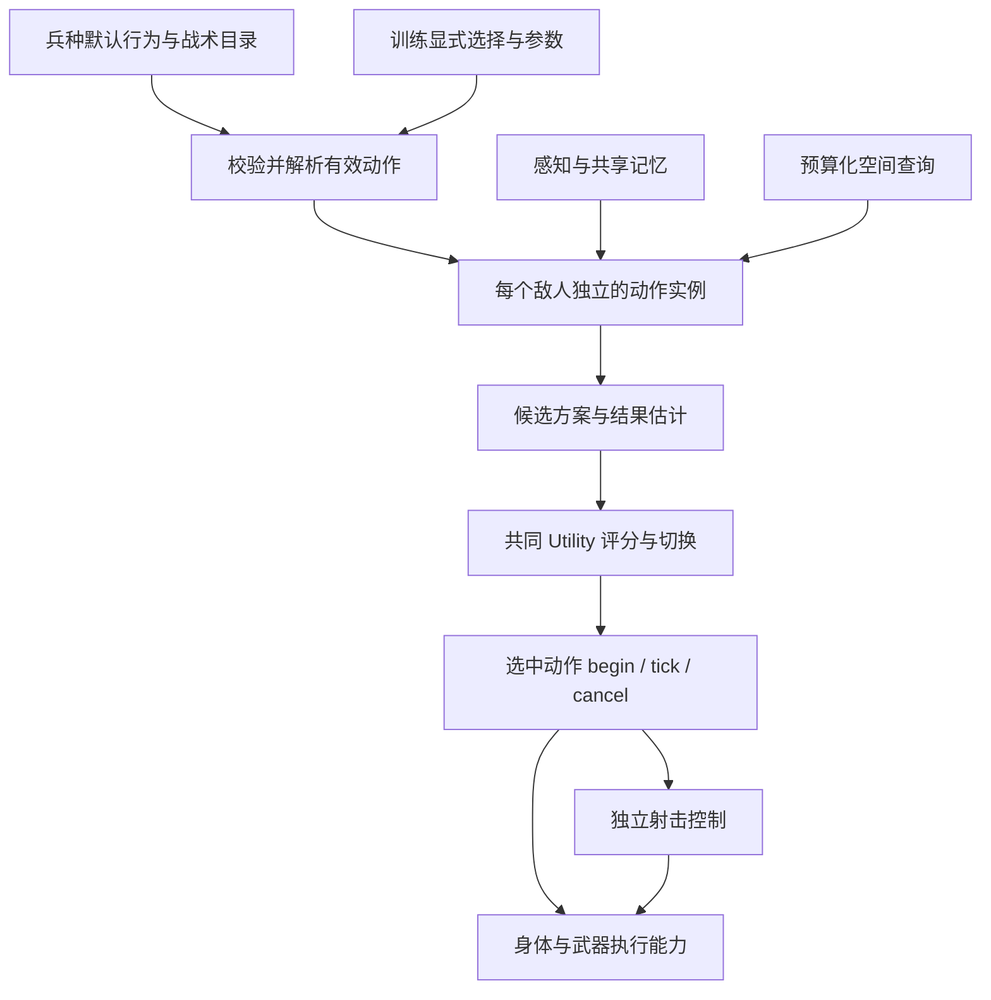

# 敌人 AI：代码结构、维护与使用部署

本次实现对应 `superpowers/specs/2026-09-28-enemy-modular-ai-design.md`。当前主场景使用独立动作模块和统一 Utility 评分，不再由 AI 主循环按具体战术 ID 分派执行。

文中 `res://` 相对于 `movement_demo/project.godot`，不是仓库根目录。先看“在 Godot 中配置敌人”进行调参；新增动作看“添加动作或新兵种”和“维护协议”；放进新地图看“接入与部署”。完整文件分类见 [项目目录](project-layout.md)。

## 在 Godot 中配置敌人

1. 打开 `movement_demo/scenes/main.tscn`，选择 `Arena/Enemy/UnitType`。
2. `profile` 是可保存、复制和复用的 `EnemyUnitProfile` 资源。现成模板位于 `resources/enemy/units/ranged.tres` 和 `resources/enemy/units/melee.tres`。
3. 展开兵种资源，可以分别配置“默认行为”和“战术动作”。默认行为仍是独立模块；模板只是预先填好的组合。
4. 选择同一敌人的 `Training`，其 `profile` 是可复用的 `EnemyTrainingProfile`。检查器上方的“战术解锁”由当前兵种的战术目录生成。
5. 训练参数在 `profile` 内分组保存。开火反应时间位于 `tactics.fire_reaction_seconds`；它是训练参数，射击服务只读取该值并记录当前敌人的计时进度。

检查器插件为 `addons/enemy_training_inspector`，已在项目中启用。若编辑器在修改代码时一直开着，重新打开项目以加载新资源类型和插件。

默认行为不在训练中重复勾选；要移除搜索或换弹模块，应修改兵种的默认行为列表。训练仍可调整这些模块的训练参数。

选择“出口压制”会自动包含“普通压制”；选择“掩护撤离”会自动包含“掩体行动”。自动包含项显示为勾选且锁定，并注明来源。二者都有独立实例与候选，不会因为高级项启用就排除基础项，也不因继承关系获得评分优先权。原有手动选择保留，取消高级项时不会误删手动启用的基础项。

更换兵种后，旧兵种独有的显式选择保存在训练资源里，但隐藏且不装配。切回原兵种可以恢复。高级项缺少兵种提供的关联基础项时，检查器解释原因，运行时拒绝启用。单独打开训练 `.tres` 时，需在面板中明确选择预览兵种；该预览不修改资源，不借用上一个敌人的兵种。

## 文件职责

运行脚本按职责放在 `scripts/enemy/` 下，整体目录见 [项目目录结构](project-layout.md)。测试与诊断集中在 `tests/enemy/`。

| 层次/职责 | 主要文件 |
| --- | --- |
| 兵种资源与节点入口 | `scripts/enemy/config/enemy_unit_profile.gd`、`scripts/enemy/enemy_unit_type.gd`、`resources/enemy/units/` |
| 训练资源与节点入口 | `scripts/enemy/config/enemy_training_profile.gd`、`scripts/enemy/enemy_training.gd`、`scripts/enemy/config/`、`resources/enemy/training/` |
| 公共动作定义和装配规则 | `scripts/enemy/config/enemy_action_definition.gd`、`scripts/enemy/enemy_action_library.gd`、`resources/enemy/actions/` |
| 动作公共协议 | `scripts/enemy/actions/enemy_action.gd` |
| 通用协调、评分与切换 | `scripts/enemy/enemy_ai.gd`、`scripts/enemy/enemy_action_selector.gd`、`scripts/enemy/enemy_utility_score.gd` |
| 公共记忆、证据和查询接口 | `scripts/enemy/services/enemy_memory.gd`、`scripts/enemy/services/enemy_context.gd` |
| 感知和空间查询 | `scripts/enemy/services/enemy_perception.gd`、`scripts/enemy/services/enemy_cover_selection.gd`、`scripts/enemy/services/enemy_spatial_evaluator.gd` |
| 射击节奏与稳枪/开火选择 | `scripts/enemy/services/enemy_fire_controller.gd`、`scripts/enemy/services/enemy_fire_decision.gd` |
| 基础执行能力 | `scripts/enemy/enemy_actor.gd`、武器和弹药组件 |

当前默认行为入口为 `scripts/enemy/actions/enemy_patrol_action.gd`、`scripts/enemy/actions/enemy_search.gd`、`scripts/enemy/actions/enemy_tactics.gd`（现仅负责远程接敌）、`scripts/enemy/actions/enemy_melee_action.gd`、`scripts/enemy/actions/enemy_reload_action.gd`。近战和远程使用不同接敌模块，巡逻与搜索可以共享。

战术入口为 `scripts/enemy/actions/enemy_cover_action.gd`、`scripts/enemy/actions/enemy_covering_retreat_action.gd`、`scripts/enemy/actions/enemy_attack_position_action.gd`、`scripts/enemy/actions/enemy_suppression_action.gd`、`scripts/enemy/actions/enemy_exit_suppression_action.gd`。掩体、撤离与换弹各自拥有 `scripts/enemy/actions/enemy_cover_motion.gd` 的移动执行实例，不访问另一个可选动作的运行实例。

`enemy_actions/*.tres` 中两个脚本引用各有用途：`script` 指向资源结构 `EnemyActionDefinition`，`implementation` 指向动作实现。多个参数版本可以共用同一个实现，公共几何和移动算法也可以使用辅助脚本。这不代表一个动作同时运行两套逻辑。

## 运行过程



动作估计共同时间窗口内的火力缺失、暴露与信息损失，由选择器统一算代价。保持时间、切换优势和动作的可中断条件控制切换。一个模块可以提供多个目的地或方案，不需要为每个内部阶段创建动作资源。

空间评估按帧分配点数与耗时预算。相同几何查询可声明共享查询通道；缓存由公共服务管理，动作之间不获取彼此实例。查询预算权重和初始近点扫描只控制计算调度，不参与动作评分或训练解锁。

共享上下文不持有动作注册表或 AI 控制器引用。动作结束通过结果和事件交回决策，不直接调用另一个具体动作。未授权模块不创建；撤销当前模块时统一取消其执行、导航目标和射击请求，其他有效模块保留实例。死亡、离场、对话暂停和战斗复位通过协调器处理公共清理。

运行开始时，每个敌人复制兵种和训练配置。运行进度留在本敌人的动作/服务中，配置资源不保存瞄准点、阶段、计时器等进度。

### 评分与射击节奏

受伤与近弹的准度损失属于公共射击服务，不依赖掩体、攻击占位或压制动作。Training → Profile → tactics 的 `damage_accuracy_penalty` 默认 0.15（15 个百分点），`nearby_shot_accuracy_penalty` 默认 0.02（2 个百分点）；0 关闭相应损失，新字段遵守 `mark_override` 和保存重载规则。身体只提供 `apply_aim_penalty` 执行接口，参数由服务读取本敌人的训练快照。近弹使用真实碰撞截断的弹道线段和遮挡检查；自己的射击、同阵营射击以及直接命中的同一发不重复计入近弹。

成功开始换弹立即将中心概率降到 0，换弹期间及完成的这一帧保持最低，然后按武器原有延迟和速度恢复。取消不返还旧准度，失败的换弹请求不改变准度。初始中心概率为 100% 时，恢复速度按 `stabilize_seconds` 内从 0 恢复到 100% 计算，避免受罚后永久不能恢复；其他初始值沿用原计算。路线评分的可开火时间必须晚于换弹完成，帧内缓存包含感知距离、枪程与枪械资格等输入，配置重置会清理路线缓存。

共同代价由火力缺失时间、暴露时间和信息损失三部分组成，数值越低越优。空间遮挡质量与血量／近期压力形成的风险承受程度分别计算。目前共同时间窗口、权重、保持时长、切换优势和威胁半衰期在 **AI 节点的 Utility AI 分组**调整；反应、行动速度、感知等训练参数在 Training 的 Profile 中。换弹也参与候选比较，包括原地换、先转移再换和移动中换，不由独立空匣入口抢占决策。

以下为 Utility 参数的脚本默认值，场景检查器中的保存值优先；悬停参数可查看同义的代码文档注释。

| 参数 | 默认值 | 调整含义 |
| --- | --- | --- |
| `Utility Horizon Seconds` | 4 秒 | 各动作共同估计未来多长时间；调大更重视到位后的持续收益，调小更重视眼前收益，不规定动作必须执行多久 |
| `Utility Fire Weight` | 3 | 火力缺失时间的代价；调大更重视维持／恢复射击，调小更能接受停火转移或躲藏，0忽略此项 |
| `Utility Risk Weight` | 3 | 暴露风险的基础权重；结合伤势、受击／近弹与近身压力，调大更重视掩护和退让，0忽略风险项 |
| `Utility Information Weight` | 1 | 信息损失的代价；调大更重视持续观察或重新找到目标，调小更能接受失视躲藏，0忽略此项 |
| `Utility Recheck Seconds` | 0.4 秒 | 正常重评间隔；调小响应更及时、计算更频繁，受击或配置变化等可提前请求重评 |
| `Utility Hold Seconds` | 0.6 秒 | 新方案通常至少保持多久；调大减少反复切换，但也延迟接管，0取消此等待 |
| `Utility Switch Advantage` | 0.5 分 | 新方案需降低超过此绝对代价差才通常允许切换；调大更稳定，调小更容易换动作，需与三个权重的尺度一起考虑 |
| `Utility Threat Half Life Seconds` | 4 秒 | 失去新证据后，旧威胁确定性减半的时间；调大保留避险影响更久，不改变受击／近弹压力自身的衰减速度或可见目标的近身压力 |
| `Debug Utility` | 关闭 | 配合 Debug 总开关，在成功切换动作后输出选中动作及代价构成；完整候选可在运行时查看 `utility_options` |

保持时间与切换分差只保护仍然有效、且没有主动释放保持的方案；动作自身的中断条件也需满足。更频繁重评不代表一定更频繁切换。希望受击后更重视躲藏，可提高风险权重或降低火力／信息权重；这些是所有动作共用的取舍，也会影响退让和转移。威胁半衰期不会删除记忆，也不等同于“受击后固定躲藏多久”。

射击服务在满足当前动作意图、反应时间、射界和武器执行条件后，比较稳枪与开火。稳定度目标是偏好：稳定度正在恢复会增加等待收益；近距离压力与已等待时长增加开火收益，避免持续移动时永远等不到目标精度。相关参数在训练的 `tactics` 和 `fire_decision` 中，具体反应、连射数量和停顿以保存的资源为准。

普通压制使用已记录的目标区域；出口压制根据最后目击附近掩体及两端射界生成方案。它们只在各自条件有效时参与统一评分，失去某个高级候选不需要由它直接启动基础动作。搜索使用目击轨迹估计和配置允许的间隔位置提示；未目击时不会通过持续读取玩家坐标来更新轨迹。

出口压制会依次检查邻近掩体，最近一面墙没有可射出口时继续尝试其他墙。射程按实际出口样本判断，最后目击位置超距不会直接否决射程内的出口。可射出口覆盖率、目击位置距墙的距离和失视时长共同估计封锁期间的信息损失，避免与普通区域压制长期同分。敌人主动躲进掩体造成的失视仍不触发压制。

掩体路线不得穿过已知威胁约 1.5 米内的近身范围；起点已经很近时仍允许向外撤离。主动接近威胁会增加路线的暴露估计。有效转移保留自己的进度，新的受伤或紧急换弹可以重评；实际受阻且绕行失败后短暂排除目的地。候选查询不探测隐藏玩家的位置，执行时的近距离避障则包含玩家身体。搜索进入调查后，同一份旧威胁不能在段边界将其拉回躲藏，新的受伤或明显新增近弹仍能解锁避险。

攻击位置使用墙角 270° 扇环区域，默认内外半径为 0.55／1.5 米。内圈禁用；身体距墙面还需保留碰撞半径加 0.1 米的余量。`enemy_attack_geometry.gd` 在已知玩家到墙角的遮挡边界附近细分区域，并从已知玩家位置向模拟敌人胶囊轮廓发射五层七列射线，按轮廓宽度加权，默认保留 20%～65% 的所属墙体遮挡。射线止于身体，敌人在墙与玩家之间不会获得身后墙体的掩护。

中心弹道、枪口前半米的三维散布空间、导航、武器射程和感知距离仍是硬条件。远处外围散布擦墙只降低有效火力估计，不再将部分遮身区域全部淘汰；实际开火复用同一枪口安全检查。预览填充绿色合格小区域、橙色其余候选区域、暗红色内圈禁用区域。颜色是有限采样的近似结果，基于最后目击信息；执行前和占位期间会复核实际位置，不保证每处绿色都比当前站位更值得转移。

基础区域保持稳定顺序，局部细分和物理查询在公共空间预算中完成；候选收集复用预算评估结果并重新计算共同代价，提交时精确复核。训练 `selection` 中的 `attack_minimum_protection`、`attack_maximum_protection`、`attack_refinement_levels` 控制遮挡范围与细分层数，默认细分一层。调高密度会增加完整刷新所需时间。

远程敌人看到玩家进入最小交战距离时，即使满血且未受击，也会产生近身风险。普通接敌允许先退一小步，再继续退回距离带；路线估计计入实际可用的移动射击时间，避免原地射击以零代价压住退让方案。隐藏玩家的实时距离不会用于这一压力。

## 添加动作或新兵种

1. 实现继承 `scripts/enemy/actions/enemy_action.gd` 的独立动作入口。通常实现 `collect_candidates`、`validate`、`begin`、`tick`、`reset`；按需要实现取消、中断、事件和空间评估接口。
2. 创建 `EnemyActionDefinition` `.tres`，填写唯一 ID、名称、类别、实现、能力要求和参数。`includes` 只声明训练自动包含关系，与脚本 `extends` 分开。
3. 将定义加入兵种对应板块。如果是战术，Training 检查器会自动出现新勾选项；如果是默认行为，无需训练解锁。
4. 需要新的参数组时，可以继承 `scripts/enemy/config/module_settings.gd`，设置 `section` 并提供导出字段，将其资源放入训练 `action_overrides`。现有 AI 和评分器无需注册新动作 ID。

新增参数字段的 setter 调用 `mark_override`，以区分“采用动作默认参数”和“训练明确覆盖”。动作定义的 `parameters` 可为兵种的某个行为提供数值变体；需要不同流程时替换实现。复用模板时，可复制某个动作定义再修改其参数，不必复制其他行为。

霰弹枪、狙击枪等细分兵种后续可以作为新的兵种配置和接敌实现加入；当前仅迁移近战/远程。能力标识、行为列表和动作协议不限制将来有哪些兵种、基础执行能力或战术。当前近战沿用接近行为，未新增近战伤害玩法。

## 迁移与回归

竞技场的现有训练覆盖值迁入 `resources/enemy/training/arena.tres`，兵种入口改为引用远程模板。迁移基于本次开始时的工作区，保留场景几何、武器参数及已有搜索提示机制。

原先已不参与 Utility 的概率开关和强制躲藏计时不再作为有效配置展示。旧远程侧移/墙体奖励字段保留存储值，但不展示为当前 Utility 的有效权重。训练节点暂留旧字段名的参数转发，便于旧调用迁移；没有第二份参数存储。未被当前场景使用的旧敌人/掩体实现及八个已被替代的旧结构测试、探针已清理，清单见实施记录。其他专项测试按各自入口保留；当前模块化系统的统一验收入口如下。

```powershell
python movement_demo/tests/enemy/run_enemy_regressions.py --godot E:/Godot/Godot_v4.7.2-stable_win64_console.exe
```

运行器把脚本异常视为失败，即使 Godot 返回 0；日志写入 `movement_demo/logs/enemy_regressions/`。可在命令末尾指定单个测试名。检查器交互检查单独运行：

```powershell
& E:/Godot/Godot_v4.7.2-stable_win64_console.exe --headless --editor --path E:/Godot/movement_demo --script res://tests/enemy/enemy_training_inspector_test.gd
```

评分、预算、实战运行、射击、压制射界、失视搜索、受阻恢复、动态装配、保存重载、资源隔离及扩展动作均有对应检查。射击节奏的独立测试隔离地图掩体，避免固定测试位置随地图编辑失效；真实射界仍由专项场景检查。重新接敌回归按“重新目击后八秒内恢复实际开火”验收，保留失视推进、持续躲藏、换弹等原有断言，避免额外合法压制过程挤占一个固定的总录像时长。

最终验证结果与环境限制记录于 `superpowers/plans/2026-09-29-enemy-modular-ai.md`。

## 维护协议

### 改动应放在哪里

| 要改的内容 | 修改位置 |
| --- | --- |
| 某兵种有哪些默认行为和战术 | `resources/enemy/units/` 中的兵种 `.tres` |
| 某训练配置解锁哪些战术、反应与数值水平 | `resources/enemy/training/` 和 Training 检查器 |
| 单个动作的触发条件、候选、执行阶段 | `scripts/enemy/actions/` 对应动作实现 |
| 所有候选共用的代价公式 | `scripts/enemy/enemy_utility_score.gd`，同时验证评分与空间候选筛选 |
| 重评、保持、统一切换和取消 | `scripts/enemy/enemy_ai.gd` |
| 实际移动、武器、弹药或命中执行 | `scripts/enemy/enemy_actor.gd`、`scripts/weapons/` |
| 共享感知、证据、射界、空间预算 | `scripts/enemy/services/` |
| 检查器选项、包含来源、撤销／重做 | `addons/enemy_training_inspector/` |

新增战术通常不需要修改 AI 或选择器。动作通过共享上下文请求公共能力，不能获取另一个可选动作实例来完成自己的执行；公共算法应提取成服务或由各动作独立持有的组件。

移除或替换动作实现时，协调器必须显式调用空间服务 `unregister`，再释放注册表中的实例；不要仅依赖弱引用自行过期。旧实例可能仍被调试器持有，同一帧撤销后恢复同名动作也必须只使用新实例。共享查询通道只移除对应使用者，其他有效动作保留注册。

### 动作生命周期

所有入口继承 `scripts/enemy/actions/enemy_action.gd`，公共接口如下。

| 接口 | 职责 |
| --- | --- |
| `setup(context)` | 接收本敌人的公共上下文，定义、ID 与参数分组由装配器赋值 |
| `collect_candidates(visible)` | 提供当前可选方案及结果估计，不执行移动、开火或切换其他动作 |
| `validate(candidate, visible)` | 提交执行前确认方案仍有效 |
| `begin(candidate, visible)` | 记录选中的方案并初始化本动作进度；不能执行时返回 false |
| `valid(visible)` | 检查正在执行的方案是否仍可继续 |
| `tick(delta, visible)` | 推进本动作，返回运动、朝向、射击意图和运行状态 |
| `cancel(reason)` / `reset()` | 清除本动作进度；取消时不能重新启动其他战术 |
| `can_interrupt(...)` / `hold_released()` | 表达中断与保持边界，供协调器统一决策 |
| `on_event(...)` / `on_shot_fired()` | 响应公共事件或实际发射结果 |
| `configuration_changed()` | 配置变化时刷新本动作依赖的参数分组或缓存 |

用基类 `option(...)` 构建候选，提供 `unavailable_seconds`、`exposed_seconds`、`information_loss` 等共同估计，最终代价由统一评分器计算。用 `motion(...)` 返回 `direction`、`multiplier`、`facing`、`fire`、`running`；完成时将本动作 `_running` 设为 false，由协调器收尾。

涉及大量位置采样时，实现 `evaluation_points()`、`evaluate_point()` 等空间接口，通过分帧服务取得结果。不要在每次候选收集时同步穷举整张地图。`evaluation_weight()`、查询通道和初始扫描数量只影响计算调度，不应解释为战术优先级。

### 配置与资源规则

- 动作 ID 在一个兵种中必须唯一；改 ID 时同时迁移训练的显式选择和 `includes`，不要只改文件名。
- 脚本继承负责代码复用；训练自动包含由 `.tres` 的 `includes` 声明。两者互不推导。
- 自动包含关系不能成环；关联动作也必须出现在当前兵种的战术目录中，且满足能力要求。
- 参数读取优先级为训练明确覆盖、动作定义参数、默认值／调用回退。新参数资源字段的 setter 调用 `mark_override`，避免保存时把未调整的默认值当成显式覆盖。
- 同一个 `.tres` 在编辑器里可以被多个敌人引用。要只调整一个敌人，先复制资源或设为唯一；运行开始时的深复制只隔离运行状态，不改变编辑器里的共享关系。
- 执行进度保存在动作／服务实例中，不写回公共定义资源。共享记忆保存证据，不能作为任意动作私有阶段的杂物箱。
- 删除一个动作前，先从兵种目录、训练显式选择和包含关系中移除，再检查场景／脚本引用，最后删除实现与 UID。运行中撤销由协调器取消，不手动清空其他动作的计时器。

### 日常维护与验证

先复现具体问题，再定位到候选估计、选案、执行或身体能力层。运行时可查看 AI 的 `utility_options`、`utility_current`、`actions`；`frame_costs` 和选择器的 `collection_costs` 记录以微秒计的耗时。Debug 总开关与 AI 的 `debug_utility` 配合使用。

只改配置时检查该兵种实际装配和行为；改协议、权限、公共服务或资源路径时运行完整敌人回归。当前统一清单和其他专项脚本的区别见 [敌人测试说明](enemy-tests.md)。保留有意义的失败记录，不能为通过测试而改变玩家地图、武器数值或放宽性能门槛。

## 接入与部署

### 在本项目运行

1. 使用当前验证的 Godot 4.7.2 标准版导入 `movement_demo/project.godot`，等待资源扫描完成。
2. 主场景入口为 `res://scenes/main.tscn`；F5 运行项目。编辑敌人时打开 `res://scenes/arena.tscn`。
3. 给 `Enemy/UnitType.profile` 选择 `res://resources/enemy/units/ranged.tres` 或自己的兵种；给 `Enemy/Training.profile` 选择训练资源。
4. 在 Training 顶部“战术解锁”勾选动作，保存场景及修改的外部资源。武器在 Enemy 的 Weapon 中调整，现有示例位于 `resources/weapons/`。
5. 运行后进入 CombatZone，观察初次接敌、失视、搜索、换弹、死亡和离场复位。检查器无战术选项时，确认插件启用、同一敌人的 UnitType 与 Training 都有资源；不要在停止运行后继续查看旧 Remote 节点。

目录迁移后建议关闭旧编辑器会话并重新打开项目，避免仍打开的旧路径场景被再次保存。继续使用项目随附的插件，不要因清理目录移除自动加载所依赖的插件文件。

### 把敌人放入新场景

最直接的起点是复制现有竞技场结构，或把 `scenes/arena.tscn` 的 Enemy 分支保存成可复用场景，再放入符合下列条件的父节点。当前没有独立发布的通用 Enemy 场景，接入任意新地图前仍需满足这些条件。

```text
Arena（或承载战斗区域的父节点）
├── CombatZone                 Area3D，能够检测玩家
├── NavigationRegion3D        已烘焙且启用的导航区域
└── Enemy                     CharacterBody3D + enemy_actor.gd
    ├── UnitType              enemy_unit_type.gd + 兵种 profile
    ├── Training              enemy_training.gd + 训练 profile
    ├── AI                    enemy_ai.gd
    │   ├── Perception        enemy_perception.gd
    │   └── Cover             enemy_cover_selection.gd
    ├── NavigationAgent3D
    ├── Body
    ├── CollisionShape3D
    └── Label / FrontMarker   沿用现有身体与调试显示结构
```

这些名称中，`UnitType`、`Training`、`AI/Perception`、`AI/Cover`、`NavigationAgent3D`、同级 `CombatZone` 与 `NavigationRegion3D` 是当前脚本直接访问的路径。重命名或改变父子关系时，需同时调整接入代码；只改变节点显示名称会导致路径错误。

场景还需有加入 `player` 组的玩家，提供当前玩家脚本的存活、对话、生命与伤害接口。直接沿用 `scenes/main.tscn` 的玩家分支最省事；用其他玩家实现时，按 `enemy_context.gd`、感知与射击服务的调用逐项适配。保留项目配置中的 `DebugSettings`、`GameState` 及现有场景所需自动加载。

导航网格、角色碰撞尺寸、Agent 半径／高度／路径高度偏移必须与地图匹配。先验证能获得有效路径，再检查 Utility 选择；场景刚加入树时导航尚未同步，不应把第一帧没有路径误判为动作失效。

新掩体建议实例化 `scenes/world/cover.tscn`，保留 `cover_region.gd` 提供的区域与查询协议。不同敌人可共享兵种模板；需要独立数值时使用各自的训练资源。当前完整性能样本主要来自单敌人竞技场，多敌人需要另外实测。

### 运行时改配置

编辑当前敌人的 `UnitType.profile` 或 `Training.profile`；协调器每帧检查配置变化。需要立即生效时，可调用该敌人的 `AI.refresh_configuration(true)`。以下例子只修改已进入运行树的敌人实例：

```gdscript
var training = enemy.get_node("Training")
training.profile.selected_tactics.assign([&"exit_suppression"])
enemy.get_node("AI").refresh_configuration(true)
```

例子要求兵种目录同时提供出口压制及其包含的普通压制，且具有要求的能力。运行时修改不会自动保存为编辑器里的训练 `.tres`。撤销正在执行的动作会统一取消导航／射击请求；无关动作实例与基础武器进度按现有规则保留。

### 打包与交付

本次完成的是项目内接入与目录迁移，尚未创建目标平台导出预设或交付安装包。正式发布时在 Godot 的导出界面配置目标平台并安装匹配的导出模板，主场景使用 `scenes/main.tscn`。

导出需包含 `scenes/`、`scripts/`、`resources/` 和实际自动加载依赖；游戏使用的 NPC 对话资源已归入 `resources/dialogue/`。优先用包含所有游戏资源的预设，再明确排除 `logs/` 与 `tests/`；不要只导出某一个场景而漏掉通过资源路径动态加载的动作、训练或兵种配置。项目已有 `logs/.gdignore`，调试副本不得打包为游戏内容。

发布前完成主场景启动、配置读取、移动和实际射击、三种换弹安排、失视搜索、死亡／复位检查，并在导出程序中复测。编辑器检查器插件用于制作资源，运行时使用已保存的配置；导出结果是否能正确运行必须由目标平台上的实际验证确认。

## 常见问题

| 现象 | 优先检查 |
| --- | --- |
| Training 没有勾选项 | 插件是否启用，UnitType/Training 的 profile 是否为空；单独打开训练资源时是否选择预览兵种 |
| 高级动作勾不上 | includes 是否缺项或成环，定义类别、唯一 ID、实现基类和能力要求是否有效 |
| 基础项勾选且灰色 | 查看“由某高级项包含”的来源；取消对应高级项后才能单独修改 |
| 改一个敌人影响多个 | 编辑器里是否共享同一兵种／训练 `.tres`，是否需要复制为独立配置 |
| 敌人完全不动 | CombatZone 重叠、player 组、导航同步、节点路径、有效动作清单 |
| 有射击意图却没开火 | 兵种枪械能力、真实射界、枪口跟准、弹药／换弹、反应／连射停顿和玩家状态 |
| 移动资源后报找不到文件 | 使用新路径重新打开场景；检查 load/preload、场景 ext_resource、自动加载和动态目录字符串 |
| 性能检查偶发超限 | 保留实际峰值，确认同时运行的游戏／编辑器负载；隔离复测，不能直接放宽阈值 |

当前仍保留少量旧参数访问兼容接口，以及尚未全部迁移的专项测试。后续移除兼容接口前应先查实际调用者，不能仅因新主场景没有直接引用就删除。
