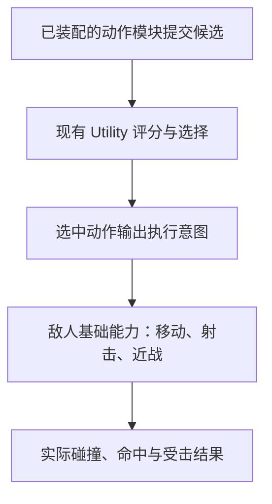

# 玩家与敌人独立近战实现设计

日期：2026-09-30

状态：玩家阶段已获用户确认；当前按最新要求先修订本设计文档，尚未修改近战运行代码。玩家近战交付试玩后，等待用户反馈与确认，再开始敌人主动近战。

## 目标与已确认要求

- 玩家按 V 进行近战。
- 玩家近战直接写在现有 `scripts/player/player_combat_v3.gd`（Player/Combat）中，沿用当前玩家射击的组织方式；不新增 `player_melee.gd` 或玩家 Melee 执行节点。
- 用户已确认：只命中面前最近的一个目标。
- 命中造成伤害，使目标当前准度直接清零，并将可移动目标向后击退。
- 玩家近战数值完全取自当前手持的远程武器：每份远程 WeaponData 资源新增独立的“近战参数”分组，从 WeaponSlots 展开该武器即可编辑。玩家不需要额外装备或切换到一把专用近战武器。
- 后续敌人阶段支持近战类武器资源；这与远程武器附带近战能力是两个概念，二者的近战参数可以采用相同含义。
- 玩家与敌人的近战代码必须分开：分别位于玩家 Combat 和敌人自身的代码体系中，各自拥有函数与运行状态，可以参考相似逻辑，但不共用近战执行组件、近战基类或近战辅助函数。不能通过同一脚本的两个实例、角色类型分支或同一函数的不同参数代替代码分离；该要求不意味着双方都必须新增一个专用近战文件。
- 尤其保持敌人现有代码结构：近战挥击属于与实际移动、射击并列的基础执行能力；是否近战通过既有动作候选和 Utility AI 选择流程决定。不得另建决策主循环，或将近战判断硬编码为全局最高优先级。
- 提供一闪而过的简单剑光，并扩展现有表现系统的近战动画接口；不接模型或动画也能正常使用。
- 根据项目 MD 中的维护说明修改代码、维护文档和项目结构；保持既有项目目录、节点路径和职责划分，保留场景与资源中的现有用户修改。具体实施与验收约束见下文“代码与项目维护标准”。

## 实施顺序与本阶段边界

1. 当前先修订 MD，使文档与已确认的实现位置、职责和顺序一致。
2. 玩家阶段：在现有 Combat 中实现 V 近战、枪械近战参数、单目标命中、剑光及动画接口；补充敌人自身的受击代码，使敌人能承受伤害、准度清零和击退。保持敌人现有 AI、动作装配、评分与主动攻击行为。
3. 玩家阶段验证通过后交付用户试玩，重点确认攻击距离、前摇、收招、击退和操作互斥的手感。等待用户反馈与确认，不自动继续敌人主动近战。
4. 敌人阶段：再实现敌人的近战控制器、actor 攻击能力、Utility 候选、近战类武器资源与装配，以及玩家承受敌人近战的独立受击逻辑。敌人不调用玩家 Combat 的近战实现。
5. 掩体接近、伺机靠近和突然冲刺等高级战术，在基础近战完成并验证后再扩展。

本阶段需要修改敌人的受击执行，以便玩家能验证击退效果；这不包含敌人主动挥击、近身推开决策或新近战武器类别的提前接入。

## 当前代码依据

- 玩家 `scenes/player/combat.tscn` 挂载 `scripts/player/player_combat_v3.gd`。玩家射击输入、准度、`shoot()`、弹道查询和命中伤害直接在该 Combat 脚本中执行，没有另一个专门的玩家射击执行脚本。
- 玩家已有的独立模块为 WeaponSlots 装备与槽位状态、WeaponData 静态参数、`weapon_ammo.gd` 弹药与换弹状态，以及玩家表现适配器。近战按这些已有职责接入。
- `scripts/enemy/actions/enemy_melee_action.gd` 当前只负责接近玩家并在指定距离停下，没有伤害判定或攻击过程。
- `enemy_action_selector.gd` 遍历已装配动作的 `collect_candidates()`，统一评分并选择候选；`enemy_ai.gd` 推进选中动作的 `tick()`，再把输出交给 `actor.move_character()` 和 `context.fire.update()`。底层执行函数本身不会自动成为 Utility 候选。
- 现有射击分为控制与实际执行：`services/enemy_fire_controller.gd` 管请求授权、反应时间、连射与停顿，并调用 `enemy_fire_decision.gd` 选择等待稳枪或开火；最后由控制器调用 `enemy_actor.gd.try_fire()`。actor 内执行扣弹、弹道采样、物理射线、命中伤害、射击冷却和射击事件。不是 actor 调用射击控制器。
- `scripts/weapons/weapon_data.gd` 保存武器静态参数；WeaponSlots 引用武器资源并分别保存运行时弹药、准度等状态。
- 玩家和敌人已有各自的准度、生命和移动实现；击退不能只赋值一次 velocity，否则会被下一帧的正常移动覆盖。
- 现有 `systems/presentation/` 负责可选模型与动画，`systems/effects/` 负责特效。游戏结果不依赖模型是否存在。

## 实现方式

按照用户明确要求，玩家和敌人的近战分别实现。即使两个实现的前摇、命中和收招逻辑相似，也不提取为双方调用的公共近战函数或共用执行脚本。

| 职责 | 玩家实现 | 敌人实现 |
| --- | --- | --- |
| 发起攻击 | 玩家输入与战斗接口处理 V | 敌人动作库通过既有动作协议表达近战意图 |
| 攻击控制与执行 | 扩展现有 `scripts/player/player_combat_v3.gd`，用独立的近战函数与状态处理 V 输入、前摇、命中查询、收招和冷却 | 用户试玩确认后，新增 `scripts/enemy/services/enemy_melee_controller.gd` 管近战请求与前摇、收招；`enemy_actor.gd` 增加近战资格、冷却和实际命中执行接口，与现有射击分工一致 |
| 武器参数读取 | 玩家 Combat 读取当前 WeaponSlots 选中的远程武器 | 后续敌人控制器与 actor 读取该敌人装备的武器，开始动作时固定本次参数 |
| 受击与击退 | 玩家已有战斗、生命与移动脚本中的独立受击实现 | 敌人身体及其自身组件中的独立受击实现 |
| 动画接入 | 玩家自己的表现适配器接收玩家近战状态 | 敌人自己的表现适配器接收敌人近战状态 |

玩家侧的具体维护边界：

- `player_combat_v3.gd`：新增近战状态与独立函数分组；射击和近战分别处理攻击过程，在同一个 Combat 中统一处理开火、换弹、近战之间的互斥。保持现有射击函数、脚本文件名和节点路径。
- `player.gd`：继续负责移动与转向，读取 Combat 的近战状态以限制冲刺并保持本次挥击朝向；不把攻击计时、索敌或伤害计算移到移动脚本中。
- `player_weapon_slots.gd`：继续负责装备切换；近战执行期间根据 Combat 状态拒绝切枪，不在槽位节点保存第二套近战攻击参数或计时器。
- `weapon_data.gd`：为现有远程武器新增近战参数分组，运行中的前摇、收招、冷却和命中记录仍属于 Combat 实例。
- 玩家表现适配器与特效目录：接收 Combat 提供的近战状态或事件，播放动画与短暂剑光。允许新增纯表现的特效脚本和场景，它们不执行攻击判定，也不代替 Combat。

玩家与敌人各自推进动作时间、判断命中、保存冷却和处理中断。新增近战的击退推进与准度清零也分别接入双方已有受击代码，不创建双方共用的近战受击处理器。命中目标时调用该目标自身的受击接口，属于角色之间的伤害交互，不调用目标的近战攻击实现。

沿用已有 WeaponData 静态资源格式与既有表现基础设施，不重建全项目的数据或模型系统；双方可以读取同名参数，但不能把攻击、命中或击退函数藏进 WeaponData 或表现组件来变相共用。玩家规则的调整不要求修改敌人近战函数，敌人规则的调整也不要求修改玩家近战函数。

新增文件依照 `docs/project-layout.md` 放入现有 weapons、player、enemy、systems/effects 等职责目录；不移动现有文件，不重排已有场景树。

## 敌人分层与 Utility AI 接入

本节仅记录用户试玩确认后的敌人阶段设计。本阶段不创建敌人近战控制器、不加入近战候选，也不修改 Utility 选择流程。

保留项目已有的分层和调用方向：

“基础近战能力”和“提交近战候选”各有职责：

- 实际近战能力由 `enemy_actor.gd` 提供，与 `move_character()`、`can_fire()`、`try_fire()` 的基础执行职责并列：检查身体和武器资格、维护近战冷却、执行当次碰撞查询与命中结算。它不自行评估哪个战术最值得使用。
- 近战控制器放在既有 `services/` 下，与射击控制器同类：接收已选动作的近战意图、验证请求授权、推进前摇与收招，并在出手时调用 actor 的近战执行接口。通过现有 context 与协调器接入，不新增自动运行的决策节点，不让 actor 反向调用动作库或控制器。
- 动作入口沿用 `scripts/enemy/actions/` 与 `EnemyActionDefinition`。后续增加轻量的近战出手动作（如 `enemy_melee_strike_action.gd` 及对应 `.tres`），负责提供候选、验证条件、请求敌人的基础近战能力以及处理动作中断。它不是新的 AI 系统，也不包含玩家近战代码。
- 现有 `enemy_melee_action.gd` 保留接近职责和已有路径。接近与挥击的候选有效性分别管理；不能因为已有文件名带 melee，就把追击战术、伤害计算和全局决策全部堆进该脚本。
- 近战出手动作通过兵种动作目录与能力要求装配。动作是否可用仍由现有装配和训练规则管理，不因为场景里多了一个近战组件就让所有敌人自动出手。

提交近战候选前检查已知目标、实际攻击距离、冷却和当前动作状态等；出手时再次检查范围与遮挡。超距、冷却未好等无效状态不提交可立即挥击的候选。候选收集与评分本身不造成伤害、不推进攻击计时。

选择器继续对所有合法候选采用现有统一规则。近战动作按现有的停火损失、暴露风险和信息损失维度提供估计：前摇与收招占用的时间会影响停火损失，近身威胁以及可能由击退获得的空间会影响风险估计。估计只能基于允许取得的感知与环境信息，不能保证隔墙或受阻时仍能推开目标，也不能直接把伤害数值当作时间代价。

这使近战能够参与 Utility AI 选择；实际是否胜出取决于候选有效性和代价。现有仅接近动作的占位估计不等于完整的近战评分，接入时需校准接近与出手的候选条件及结果估计，并验证近距离能够选择近战、远距离仍选择接近或其他动作。不能用“只要距离近就绕过 Utility 强制挥击”或给近战硬塞最低代价代替正确接入。

执行阶段在现有动作输出协议中兼容增加可选近战意图，缺省为空，旧动作的移动与射击输出保持有效；协调器只做通用意图转交与生命周期清理，不按 `melee_strike` 等具体动作 ID 分支。必要的能力查询、射击互斥、取消和复位接口按原有职责扩展，文档与回归同步更新。

近战控制器只拥有各敌人自己的请求、动作阶段、参数快照与阶段计时；actor 拥有实际武器执行条件、近战冷却和受击状态。冷却由身体更新统一推进，不因动作切换或控制器取消而重置；取消只清除未完成的动作阶段，死亡与训练复位按原有生命周期清理各自状态。各个状态只有一个拥有者和一个推进入口，避免控制器与 actor 各存一份冷却。

因此，后续的调用关系与射击对应为：`已选动作 → enemy_ai 转交意图 → enemy_melee_controller → enemy_actor 的近战执行接口`。增加服务文件与必要的 actor 方法是在现有职责中扩展能力，不能把感知、Utility 选择、接近战术和伤害结算一起转移到一个独立近战总管中。

远程敌人“近战推开再拉开距离”可以在后续通过动作候选与阶段组合使用这些底层能力。移动、射击和挥击的执行仍各在自己的原有层次；高层动作之间不调用另一个动作的运行实例。

## 代码与项目维护标准

本节为实施约束和验收标准，功能实现时必须遵守。

1. 修改前核对 [项目目录](../../project-layout.md)、[敌人 AI 维护协议](../../enemy-ai.md)、[武器槽](../../gameplay/WEAPON_SLOTS.md)、[换弹规则](../../gameplay/AMMO.md) 和 [表现接口](../../gameplay/PRESENTATION.md)。实现与已有协议衔接；涉及协议扩展时同步维护相应 MD，不另建与既有机制竞争的实现。
2. 保持现有代码职责：WeaponSlots 管装备选择与槽位运行状态，WeaponData 管静态武器参数；现有玩家 Combat 管玩家射击与近战，后续敌人 services 中的近战控制器管敌人动作阶段并调用 actor 的实际近战接口；各自角色身体管受击与碰撞移动，各自表现适配器向既有表现系统传递状态。冷却、命中记录、击退进度保存在各自运行实例，不写回共享资源。玩家和敌人的近战执行代码不得合并到同一文件、共用函数或公共近战基类中。
3. 敌人动作通过既有动作协议表达意图，不直接调用另一个动作；AI 协调器、选择器和统一评分器不按某个近战动作 ID 增加专用分支。敌人身体负责基础能力，接敌距离、出手时机、掩体接近等决策仍属于动作和服务。
4. 新脚本、场景、配置与测试按现有目录职责归位；保留已有 `.gd.uid`、资源引用、节点名称和路径。优先增加必要字段、组件与接口，不进行无关目录迁移、主流程重写或文件改名。
5. 旧远程武器资源兼容加载，原有射击、弹药、换弹、瞄准数值保持原意。新增近战字段使用独立默认值，不覆盖用户已有的枪械数值、兵种配置、训练开关、地图布局、碰撞或导航几何。
6. 依照 [敌人测试说明](../../enemy-tests.md) 运行对应验证；修改公共能力或接口时运行完整敌人回归。同步维护受影响的玩法说明、参数说明、结构说明与 TODO，不能仅完成代码而留下过时的使用说明，也不能为通过测试改变无关玩法或放宽门槛。
7. 敌人结构保护单独验收：保留动作资源装配、候选收集、统一评分与切换、动作输出、身体执行这条链路。仅按职责扩展近战能力、候选入口与兼容协议字段；不重写选择器、替换评分体系、移动已有模块或增加绕过 Utility 的自动近战分支。

## 玩家使用过程

1. 按下 V，检查角色存活、游戏未暂停、未处于对话、当前武器允许近战以及攻击已就绪。
2. 开始前摇，记录此次攻击的武器参数和朝向。攻击从角色当前位置发出，朝向在本次攻击中保持一致。
3. 前摇结束，在此刻检查范围、正面角度、高度与遮挡，最多选中一个最近的有效目标。目标离开范围可以躲开。
4. 出手时播放短促剑光；命中则结算伤害、准度清零和击退。挥空也播放剑光并消耗本次攻击机会。
5. 收招结束，恢复其他武器操作；达到冷却时间后允许下一次近战。按住 V 不连续自动挥击。

近战可在一般移动状态发起，也可在持枪瞄准时发起。只影响允许受击的 combat_target，NPC 不作为有效目标。默认不增加体力消耗。

## 命中与受击规则

- 在前方限定距离和角度内筛选，加入高度容差，避免打到不同楼层的目标。
- 检查墙体与掩体遮挡，不能穿过遮挡打到目标。按距离从近到远选择可实际命中的目标。
- 每次挥击只进行一次伤害结算；同一角色的多个碰撞形状不会重复受伤，也不会在收招期间换一个目标再次命中。
- 伤害继续使用既有生命与受击入口，保留现有死亡、训练靶与无敌规则。
- 近战额外将目标当前归一化准度设为 0，并重新开始该武器的准度恢复等待。概率模式表现为最低准度；散布模式表现为最大散布。之后按既有规则恢复，切枪不能立即绕过受击惩罚。
- 击退方向为攻击者指向目标的水平向外方向；两者位置重合时使用挥击方向。
- 击退使用现有角色碰撞移动，与自主移动合成后执行 move_and_slide；墙壁会阻挡，不通过直接改坐标或 Tween 推过碰撞体。
- 敌人等可移动角色能够击退。固定训练靶保留原有固定性质，接受对应的命中与伤害统计；NPC、掩体不会因本次功能变为可击退角色。
- 死亡或训练重置时清除剩余攻击与击退状态；暂停时停止推进，避免恢复游戏后补结算过期攻击。

## 武器资源与武器槽中的配置

玩家编辑位置：`Player → WeaponSlots → Primary Weapon / Secondary Weapon → 当前远程武器资源 → 近战参数`。也可以从文件系统直接打开该枪械 `.tres` 修改同一组字段。

在现有 WeaponData 中新增“近战参数”导出分组，字段使用 `melee_` 前缀，与射击参数明确区分。射击伤害继续使用现有 `damage`；近战伤害使用独立的 `melee_damage`，不能直接拿子弹伤害代替，也不从玩家脚本、槽位节点或额外装备读取另一份近战数值。

例如，手枪资源可以配置近战伤害 20、距离 1.3 米；步枪资源可以配置近战伤害 30、距离 1.6 米。玩家拿手枪按 V 就读取手枪的近战参数，切到步枪后再按 V 就读取步枪的近战参数。此例仅用于解释配置关系，不修改现有武器的平衡数值。

两个武器槽可使用不同远程武器资源，因此手持不同枪械时近战数值不同。若两个槽引用同一资源，它们共享这份静态配置，与现有武器规则一致；攻击计时和受击状态不写回资源。

玩家阶段只为现有远程武器增加近战字段。后续敌人阶段再支持“远程／近战”武器类别，继续使用现有 WeaponData 资源体系，旧资源缺省类别为远程。远程武器既有射击参数，也有近战参数；敌人使用的近战类武器以同一组近战参数作为主要攻击配置，不进入枪械射击、耗弹或换弹流程。武器类别与敌人兵种类别分别表达装备和行为能力，配置了近战武器本身不会自动加入攻击 AI。

上述一致性仅指静态参数的结构和含义；玩家与敌人分别读取装备资源，分别执行攻击，不共用近战函数。敌人的武器可以配置为独立 `.tres`，无需引用玩家正在使用的那份武器资源。

敌人近战武器的数据支持与示例资源安排在后续敌人阶段，资源放在现有 `resources/weapons/` 下；不为玩家新增近战装备槽或要求玩家换成纯近战武器。当前保留敌人场景中的装备配置。

下列仅为首次实现时的可调起点，需结合实际手感验证：

| 参数 | 初始建议 | 含义 |
| --- | --- | --- |
| 启用近战 | 是 | 可单独关闭某把远程武器附带的近战能力 |
| 近战伤害 | 25 | 每次近战命中的伤害，与子弹伤害分别配置 |
| 攻击距离 | 1.6 米 | 正面有效范围 |
| 攻击夹角 | 90 度 | 左右各 45 度 |
| 高度容差 | 1 米 | 限制目标的垂直距离 |
| 前摇 | 0.12 秒 | 按键到实际出手的时间 |
| 收招 | 0.25 秒 | 出手后恢复武器操作的时间 |
| 攻击间隔 | 0.6 秒 | 两次攻击开始之间的最短间隔 |
| 击退距离 | 1 米 | 无遮挡且目标不主动移动时的参考距离 |
| 击退时长 | 0.2 秒 | 外力逐渐衰减的持续时间 |

准度清零是本次近战的固定规则，无需用户为每把武器重复配置。暂不增加连击、蓄力、耐力消耗或元素属性。

## 与现有操作的关系

- 近战期间允许普通移动，暂停冲刺；不同时开枪、换弹或切枪。
- 按 V 可以打断正在进行的换弹，沿用现有换弹中断和半程检查点规则。近战结束后才允许现有换弹恢复逻辑继续运行。
- 清除本次被打断的开火请求，避免收招结束瞬间意外补射。
- 进入对话或死亡时取消尚未出手的攻击，不留下稍后突然命中的计时器。
- 同一角色只有一份近战冷却；更换武器不会重置冷却。
- 没有武器或当前武器禁止近战时，安全拒绝攻击，不影响原有移动与射击。
- 现有远程武器即使尚未保存新增字段，也通过字段默认值获得基础近战；关闭“启用近战”即可禁用该枪械的近战能力。

## 剑光与动画接口

剑光使用简单的程序几何和透明材质，出手时在前方闪现并淡出，无需外部图片或模型。特效不带伤害碰撞、不搜索目标，方向与本次实际挥击一致。节点有明确的结束与清理机制，暂停和场景重置时不会残留。

现有动画配置增加 `melee` 槽；表现状态传递近战是否进行、所处阶段与进度，供模型播放对应动作。攻击开始、命中时刻和动作结束由游戏逻辑决定。接入动画时按配置的动作时间对齐，不使用动画回调决定伤害。

本阶段由玩家 Combat 向玩家表现适配器提供近战状态与事件；后续敌人由自己的近战控制器和 actor 向敌人表现适配器提供状态。表现系统不承载任何双方共用的近战攻击或受击执行函数。

未配置 melee 动画时沿用现有可用表现；未配置模型时仍能看到简单剑光，攻击和受击照常运行。后续可以替换剑光场景和动画资源，无需重写近战玩法。

## 敌人后续接入

此阶段在玩家近战交付试玩、用户反馈并确认继续之后开展。敌人沿用现有射击的分工：`scripts/enemy/services/enemy_melee_controller.gd` 控制前摇和收招，`scripts/enemy/enemy_actor.gd` 提供实际近战资格查询、冷却与命中执行。它们均不继承、加载或调用玩家 Combat 的近战实现，也不使用玩家与敌人共用的近战执行服务。追谁、何时接近和是否选择近战仍由敌人自己的动作候选与 Utility 流程决定。

后续基础 AI 接入分为：

1. 近战敌人：接近 → 进入距离 → 挥击 → 收招与冷却 → 再次接近或出手。
2. 远程敌人：玩家过近时选择近战推开，再由现有移动动作争取距离；出手后的撤离属于 AI 决策。
3. 掩体接近、等待时机和突然冲刺：在基础近战验证后增加独立动作与评分参数。

本轮不会把这些战术判断塞进敌人身体脚本，也不会更改用户当前的兵种、训练动作开关或场景摆放。

## 验证与文档

### 玩家阶段

- 玩家攻击实现位于现有 `player_combat_v3.gd`，没有新增玩家近战执行脚本或 Melee 节点；射击、换弹和近战互斥使用同一 Combat 的真实状态。
- 正面单目标命中、多个目标只命中最近一个、背后与距离外不命中、遮挡不命中、高度差不误伤。
- 挥空、按住 V、连按 V、目标在前摇期间离开或死亡时，攻击次数与冷却正确。
- 敌人被玩家近战命中后当前准度为 0，恢复等待生效；受击清零不被既有射击或移动惩罚的下限抬高。玩家选择概率或散布射击模式均不影响近战判定。
- 击退不会被正常移动覆盖，也不会穿过墙；不同帧率下无障碍位移接近配置值。
- 两个武器槽的配置分别生效，切枪不能重置冷却；前摇开始后本次参数保持一致。
- 玩家只装备现有远程武器即可按 V 攻击，分别修改子弹伤害和近战伤害互不影响；从槽位展开和直接打开同一武器资源时，近战参数一致。
- 旧远程武器资源兼容加载，缺少新增字段时使用近战默认值，原有射击与换弹参数保持原意。
- 与射击、半程换弹、暂停、对话、死亡、训练重置正确互斥或清理。
- 空模型和空动画可用；接入近战动画后不改变攻击结果；剑光正常结束并清理。
- 审查玩家和敌人的近战执行文件与调用关系：各自实现攻击流程、命中查询和受击反应，没有共用近战函数、公共近战基类或单一组件的角色分支。允许调用目标自身的受击入口和现有通用数据、表现接口，但这些入口不得代替双方独立的近战实现。
- 玩家近战验证不依赖敌人的主动近战控制器或候选；敌人修改仅覆盖必要的受击与击退执行，AI 结构与主动行为保持原有方式。
- 执行与改动相关的战斗、敌人及表现回归，结合实机检查 V 操作与剑光效果；不为本次功能改写无关玩法。
- 补充近战使用与调参说明，更新 README、武器槽说明、敌人说明、目录说明、表现接口文档和 TODO 中的对应状态；依照“代码与项目维护标准”核对最终改动。

### 用户试玩后的敌人阶段

- 审查敌人近战与现有射击的分工一致：控制器接收意图并调用 actor 执行；actor 不反向调用控制器、动作库或 Utility。检查近战冷却只在身体更新入口推进一次，动作阶段只在控制器推进一次，动作取消不能刷掉身体冷却。
- 玩家与敌人的近战验证分别组织；敌人攻击测试使用受击目标接口或测试替身，不依赖玩家 Combat 的近战函数。
- 检查 `utility_options` 中的近战候选及代价、`utility_current` 的实际选择与底层出手次数；覆盖近距可选、超距和冷却排除、出手前条件失效、训练撤销、中断与复位。保留旧动作输出的兼容性，并确认不存在绕过 Utility 的强制挥击或具体动作 ID 特判。
- 敌人近战类武器可读取近战字段，枪械射击与换弹入口不会把它当枪使用；旧远程武器按远程类别兼容加载。
- 玩家受到敌人近战后，概率与散布模式的准度清零及恢复都正确，切枪不能跳过受击惩罚；玩家的击退实现不与敌人共用近战受击函数。

## 审阅要点

当前先改文档。玩家阶段的攻击逻辑写在现有 `player_combat_v3.gd` 中，全部可调近战数值来自当前远程武器资源；敌人仅补充承受伤害、准度清零与击退的独立受击实现。玩家近战交付试玩后等待用户反馈与确认，再做敌人主动攻击、Utility 候选和近战类武器接入。双方近战实现分开，保持敌人现有分层，修改全程遵循项目 MD 的维护说明。
