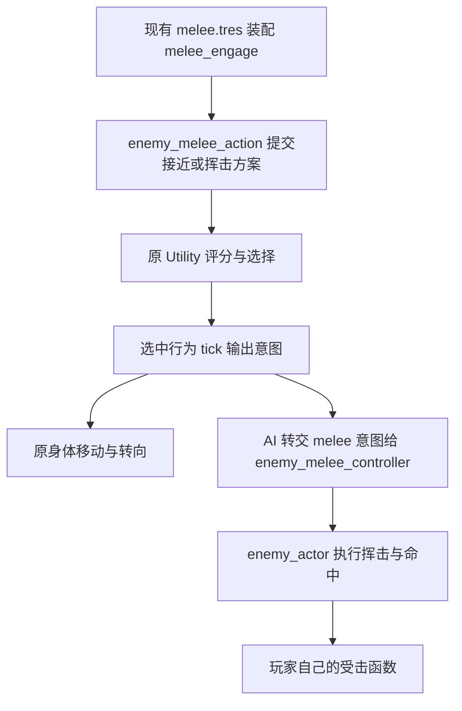

# 近战武器类型与现有近战兵攻击循环设计

日期：2026-09-30

状态：重新核对代码后编写的设计草案，待用户审阅；本文不表示运行代码已经实现。

## 目标与依据

给现有 `WeaponData` 增加明确的近战武器类型，通过原有装备入口交给**已经存在的近战兵**，补齐它从接近、挥击到再次接近的基础循环。

本设计独立说明本阶段，不要求后续 agent 从旧近战设计中拼接方案。旧设计保留玩家和远程敌人阶段的历史记录；其中“专用近战武器、近战兵攻击循环后置”描述的是此前范围。用户现在要求设计这部分，不代表批准其中所有技术选择，更不代表批准掩体迂回、突袭冲刺等高级战术。

维护依据为 [AGENTS.md](../../../AGENTS.md)、[项目目录与文档维护约束](../../project-layout.md)、[敌人 AI](../../enemy-ai.md) 和 [敌人验证要求](../../enemy-tests.md)。用户指示优先，不能反过来改写这些规则以适应实现。

### 用户已明确的要求

- 使用现有近战敌人单位，不把“新增一个近战兵种”当成待完成工作。
- 增加近战武器类型，并供近战敌人装备。
- 保持玩家与敌人的攻击、命中与受击实现分离；敌人不同兵种可以使用同一套敌人基础执行能力。
- 挥击与实际移动、射击并列，处于基础执行层；由现有行为组织并经过 Utility 选择，不能另设全局强制近战分支。
- 玩家继续使用手持远程武器里的近战参数，不引入玩家专用近战武器或第三个装备槽。
- 保留既有近战伤害、准度清零、物理击退，以及可选动画与特效接口。没有模型或动画也能运行。
- 依据项目 MD 维护结构、职责、接口与文档；每完成可验收的大步骤，按 AGENTS.md 审查、提交并普通推送 GitHub。

以下类型字段命名、候选组织、初始参数和装配建议属于本设计提出的实现选择，不写成用户已经确认的要求。

## 代码核对：已经有什么，还缺什么

核对基准是本地工作区，包含此前尚未提交的近战与表现接口修改；本轮开始时 HEAD 为 `517b395`。不能仅检出这个提交，就假定下表所有本地能力都已经存在。实施前必须重新检查工作区及 Git 差异，保留既有修改，不借本次设计提交顺带暂存未审查的代码。

表中工程路径均相对 `movement_demo/`。

| 位置 | 已核对的实际情况 | 本阶段需要补齐的内容 |
| --- | --- | --- |
| `resources/enemy/units/melee.tres` | 已有 `unit_id = melee`、名称“近战兵”，默认行为为巡逻、搜索、`melee_engage` | 沿用这个兵种，不新建同义兵种或挥击装配项 |
| `resources/enemy/actions/melee_engage.tres` | 已引用 `actions/enemy_melee_action.gd`，显示名称“近战接近” | 保留动作 ID、资源与脚本路径 |
| `scripts/enemy/actions/enemy_melee_action.gd` | `tick()` 寻路接近，达到训练中的停止距离或导航终点便停下；没有提交近战请求 | 衔接有效接近、转向、挥击请求和冷却后的追击 |
| `scripts/weapons/weapon_data.gd` | 有 `FireMode`、`AmmoType` 和 `melee_*` 参数，尚无远程／近战武器分类 | 增加武器分类；保留现有资源类和字段 |
| `scripts/enemy/enemy_actor.gd` | `equip_weapon()` 接收 WeaponData；`can_use_firearms()` 检查身体、射击开关和兵种枪械能力；已有近战执行接口 | 枪械资格还需检查武器类型，纯近战不能开枪或换弹 |
| `scripts/enemy/services/enemy_melee_controller.gd` | 已接收选中行为的近战意图，管理前摇、收招和参数快照 | 由现有近战接敌行为调用，不再写一套近战控制器 |
| `scripts/weapons/weapon_ammo.gd` | 所有非空 WeaponData 都按至少一发的弹匣初始化 | 纯近战应没有可用弹药及换弹状态 |
| `scenes/enemy/enemy.tscn` | 通用敌人场景已有 Weapon、UnitType、Training、AI 等入口，默认使用远程兵种 | 用现有 Weapon 与 UnitType 配置完成近战兵装配 |
| `scenes/arena.tscn` | 已保存的 Enemy 实例继承通用场景，当前没有覆盖成近战兵 | “已有近战兵单位配置”与“当前地图实例配置”分开说明，不据此要求再造一个兵种 |

`EnemyUnitProfile` 当前只组织身份、能力和行为清单，武器由敌人身体配置。不能为了自动装备而擅自在兵种资源中新增第二份武器来源，也不能按 `unit_id == melee` 硬编码装武器。

## 方案选择

建议在现有 WeaponData 内增加类型，继续使用原有 `melee_*` 参数。这样槽位、敌人 Weapon 引用、资源检查器和表现接口仍围绕原来的数据类型工作。

另两个方案都不适合本阶段：把近战伪装成“零弹药枪械”不能清楚表达类型，现有弹匣初始化还会强制至少一发；另建近战武器资源基类／子类则会扩散到装备和参数读取接口。当前只需两种武器分类，没有必要重建武器体系。

## 武器类型、参数与检查器

建议新增 `WeaponType { RANGED = 0, MELEE = 1 }` 及 `weapon_type` 字段，检查器显示“远程武器／近战武器”。缺省为 RANGED，旧 `.tres` 无需补写字段即可保持原行为。原有 `FireMode` 和 `AmmoType` 的编号与用途不变。

| 类型 | 射击、弹药、换弹 | 近战参数的用途 |
| --- | --- | --- |
| RANGED | 继续使用原有枪械参数及资格检查 | 枪械附带的近战能力；玩家 V 与远程敌人的近身推开使用这些数值 |
| MELEE | 禁止射击，不初始化可用弹匣，不允许换弹，不产生枪声或子弹命中特效 | 专用近战武器的攻击参数，供现有近战兵使用 |

`melee_enabled` 对两类武器都有效：false 表示不能挥击。MELEE 配成 false 时就是没有可用攻击的配置，不偷偷改回 true，不回退成射击；制作时提示原因，运行时安全拒绝攻击。

继续使用 `melee_damage`、范围、扇形角、高度差、前摇、收招、间隔和击退字段；不复制第二套同义参数。敌人不读取 `melee_stamina_cost`，保留“近战体力消耗（仅玩家）”注释及显示说明，不在本阶段给敌人增加体力系统。

新增一个 `resources/weapons/enemy_test_melee.tres`，类型为 MELEE，名称建议“近战测试武器”，近战开启。首次验收可沿用当前基础近战默认值：伤害25、距离1.6米、前摇0.12秒、收招0.25秒、开始间隔0.6秒、击退参考距离1米。这些仅是建议的可调初值，不是用户指定的平衡数值，不改现有枪械资源。

检查器沿用 `addons/weapon_mode_inspector/weapon_inspector.gd`：类型为 MELEE 时展示名称和近战参数，隐藏枪械的弹匣、换弹、枪声、射击和瞄准参数。切回 RANGED 恢复原显示及保存值；隐藏字段不能清零或删除。类型切换必须即时刷新检查器，保存、重开、撤销／重做后显示与值一致。

WeaponData 只提供静态配置及必要的类型查询，不放攻击、击退或计时函数。

## 枪械与玩家兼容边界

敌人能否射击应同时满足原有资格和 `weapon_type == RANGED`。检查必须落实到 `enemy_actor.can_use_firearms()` 等执行入口，不能只靠近战兵目前没有 `firearms` 能力来碰巧禁枪：远程兵误配 MELEE 也不能发射或换弹。

`weapon_ammo.gd` 继续是既有弹药模块。MELEE 的弹匣余量、可用备弹为0，`can_fire()`、`can_reload()` 为 false；不保留可推进的换弹阶段，不操作共享备弹池。两种类型经 `equip_weapon()` 互换时，沿用已有取消与初始化流程，不能残留旧换弹或未完成近战。正式运行时换类型通过重新装备资源完成，不新增热编辑系统；每次枪械请求仍需校验当前类型，不能因旧弹匣有余量而绕过限制。

敌人的近战资格仍由武器近战开关、身体和冷却决定，不要求 `firearms`，也不依赖 `shooting_enabled`。远程枪械的近战推开继续有效。

玩家不增加专用近战装备玩法。建议在现有 WeaponSlots 的可装备判断与 Combat 装备入口加入类型检查：错误填入 MELEE 时该槽视为不可用，初始槽不可用则按原规则寻找另一有效槽，两槽都不可用则无武器；运行时拒绝切到错误槽，保留当前有效装备。不要为了防误配新增玩家攻击文件。有效远程槽的弹匣、准度、体力与 V 近战规则保持原样。

敌人状态显示只呈现实际有意义的武器状态：MELEE 不显示虚构弹匣、换弹条或枪械准度。玩家被其命中后仍由玩家自身受击代码将当前准度降至最低并处理击退。

## 现有近战兵怎样使用基础挥击

保留 `melee_engage` 作为既有的近战接敌行为。它负责“怎样接近以及何时请求攻击”，不负责扣血或推进攻击计时。

这里的“挥击方案”是同一接敌行为的候选方案，不是新增默认行为或战术行为。保留原有三个默认行为，不新增 `melee_strike.tres`、独立挥击动作脚本、训练勾选项或自动决策节点。

### 基础循环

| 情况 | 现有近战接敌行为负责的工作 | 基础执行负责的工作 |
| --- | --- | --- |
| 看见目标，距离不足以攻击 | 导航接近可见目标，保持面向；必要时重新寻路 | 原移动和转向 |
| 已在有效范围但尚未面向目标 | 停在合理距离并继续转向，不能因没有挥击候选而永远不转身 | 原转向 |
| 距离、朝向、视线和冷却允许攻击 | 提供挥击方案；被选中后提交 `melee = { owner: action_id }`，不提交开火 | 控制器复核资格、快照参数、开始前摇 |
| 前摇及收招 | 持续提交本行为的授权意图；本版近战兵停步完成动作 | 控制器计时，actor 在出手点只判定一次伤害 |
| 一次攻击结束但仍在冷却 | 结束本次挥击方案，交回正常重评；目标已被推远则重新接近，在范围内则转向等待 | actor 独立推进剩余冷却 |
| 目标可见但在前摇中退远 | 不补一次远距离命中，不重启这一击 | 按出手时实际几何挥空并完成本次收招 |
| 正常失视或目标不可用 | 结束接敌，由已有搜索／巡逻及公共生命周期接管 | 取消未完成挥击，不追踪隐藏目标的实时坐标 |

近战兵本版不会照搬远程兵“推开后向后退”的策略：近战兵收招后继续追近，远程兵保留原先为拉开距离提供的接敌方案。这是两种现有行为组织同一敌人基础执行能力，不能让两个行为互相调用运行实例。

### 距离和导航

目前 `tactics.stopping_distance` 缺省1.3米，不能继续无条件作为停止距离。有效停止距离应由训练偏好和当前武器 `melee_range` 共同限制，并留出小的执行容差；调整短武器后，敌人不能停在武器够不到的位置。

命中距离继续使用双方脚底的水平距离，保留高度、扇形和身体间遮挡复核。不能把“导航到达终点”当成“目标已经可攻击”。隔墙、路径不完整或实际身体间距达不到配置射程时，不穿墙、不强行移动角色、不私自扩大武器范围；保持合法的接近／重新寻路，并提供调试原因。寻路使用既有导航、查询预算及有效位置约束，不每帧全图搜索。

### Utility 候选与生命周期

候选继续使用 `id = melee_engage`，建议通过 `plan = approach / melee` 区分接近与挥击。转向和冷却等待属于接近方案的内部情况，不再拆成新的装配资源。

准备攻击时，只有距离、朝向、视线、武器和冷却均合法才产生可立即挥击的候选；此时“还需接近”的旧方案应失效或释放保持，避免旧接近方案因保持时间一直挡住挥击。其他合法行为仍参加原统一选择，不能在 AI 主循环写“距离近就强制执行”。

**已开始挥击的有效性不能再要求 `actor.can_melee()` 为 true。** 攻击开始后身体进入忙碌和冷却，本来就不能再次开始；此时应根据控制器 owner、正在执行的阶段以及环境权限判断本次动作是否继续有效。否则每次前摇都会被自己的忙碌检查取消。

一次挥击的前摇、收招保持原中断约束；完成后释放方案并正常重评，不能通过在同一旧方案中反复重新开始来绕过选择。死亡、离场、对话、动作撤销、换武器等强制取消不受普通保持时间阻挡；暂停冻结计时。

前摇锁定本次出手朝向，行为输出应与控制器保存的方向一致，不能一边视觉跟踪转身、一边沿旧方向判定命中。攻击中的参数变更不改写这一击的快照；下一击重新读取武器数值。

候选结果仍提供共同时间窗口内的 `unavailable_seconds`、`exposed_seconds` 和 `information_loss`。近战接敌根据实际路径、接触时间、转向、剩余冷却与动作占用估计攻击不可用时间；不能拿纯近战不存在的弹药或换弹时间估计，也不能沿用当前“不可用时间恒为整个窗口、暴露恒为0”的占位结果。其他枪械行为的估计含义和原评分公式保持原样，不加固定最高优先级、不直接把伤害数值当作秒数。

控制器仍只拥有阶段、快照和阶段计时；actor 仍只拥有身体执行与近战冷却；行为只保存选中的方案及接近进度。禁止复制一份冷却到动作脚本中。

## 装配与表现接入

沿用现有场景结构，近战敌人的配置组合为：

| 现有入口 | 配置 |
| --- | --- |
| `Enemy/UnitType.profile` | `res://resources/enemy/units/melee.tres` |
| `Enemy.weapon` | `res://resources/weapons/enemy_test_melee.tres` |
| `Enemy/Training.profile` | 沿用已有训练入口；调整接近偏好时修改对应实例的配置 |

UnitType 决定装配哪些行为，Weapon 决定武器能做什么以及数值，两者不互相覆盖。仅把近战武器交给远程兵，不应自动替换它的兵种或行为列表。

本设计不再要求用户选择“新增近战兵还是替换远程兵”。需要在当前地图直接试玩时，建议用已有 Enemy 实例覆盖上表的两项引用，位置、子节点和通用 `enemy.tscn` 的远程默认值保持原状；这是建议的试玩配置，不冒充用户已选定的地图修改。功能验证可在测试实例中应用相同配置，不依赖新增一个敌人场景。

继续使用 `EnemyPresentation`、已有 Melee 动画槽以及现有 `melee_started / melee_struck / melee_finished` 事件；没有模型或动画仍由逻辑正常命中。简单剑光继续只做表现，动画事件或特效碰撞不能成为伤害来源。本阶段不制作正式近战武器模型、挂点或新美术资源。

## 修改范围与结构验收

| 文件或范围 | 允许的修改职责 |
| --- | --- |
| `scripts/weapons/weapon_data.gd` | 类型字段、兼容缺省值、静态参数说明和检查器刷新支持 |
| `scripts/weapons/weapon_ammo.gd` | 纯近战无弹药／换弹的类型边界，保持原枪械流程 |
| `addons/weapon_mode_inspector/weapon_inspector.gd` | 按类型显示参数，保留保存值与现有模式显示 |
| `resources/weapons/enemy_test_melee.tres` | 新增武器资源，不能覆盖已有远程武器 |
| `scripts/enemy/enemy_actor.gd` | 枪械资格与状态显示的类型限制，必要的只读执行状态查询 |
| `scripts/enemy/actions/enemy_melee_action.gd` | 扩展现有接敌候选、有效性、移动／转向和近战请求衔接 |
| `scripts/enemy/services/enemy_melee_controller.gd` | 优先直接复用；确有必要时只补通用查询，不增加兵种分支或决策 |
| `scripts/player/player_weapon_slots.gd`、`player_combat_v3.gd` | 仅处理误配纯近战资源的装备边界，不改玩家攻击组织方式 |
| 既有测试、运行器和专项文档 | 增加有意义的行为验证，准确记录设计状态和完成阶段 |

装配引用如需保存到场景，只修改相应实例的 Weapon 与 UnitType 引用。基础场景树、导航、地图布局及现有用户调参不借机重写。

本方案不要求修改 `enemy_action_library.gd`、`enemy_action_selector.gd`、`enemy_utility_score.gd` 的结构或统一公式，也不要求在 `enemy_ai.gd` 增加具体兵种／动作判断。若实施发现现有协议无法满足需求，应先给出实际缺口与最小扩展依据，不能把框架改完再倒改本文件。

## 行为验收

以下为后续实施的验收要求，不是本次文档编辑已经通过的功能测试。

1. **资源兼容：** 未保存类型的旧武器仍为远程，原枪械参数值不变；近战类型保存／重载正确，检查器切换、撤销／重做不丢数值。不能靠把弹匣容量调成0来禁枪。
2. **禁枪边界：** 近战兵与远程兵分别装备 MELEE，通过实际执行入口均不能开枪、扣弹、换弹或发出枪声；换回 RANGED 后原资格与枪械流程恢复。切换装备取消旧的未完成动作。
3. **近战兵自主攻击：** 使用已有 melee.tres、通用敌人场景和真实导航，让 Utility 自主接近、转向、开始挥击并命中玩家；验证伤害、准度清零和物理击退。测试不能直接选定挥击或调用 execute_melee() 冒充决策成功。
4. **连续交战：** 玩家被推开后敌人能够再次接近并攻击；未对准时会转身；冷却内不能重复命中；合法短射程不因旧停止距离而永远够不到。前摇中玩家移动出范围可挥空。
5. **碰撞与信息：** 墙体、高度差、不完整路径、不可达的过短射程均不产生虚假命中；失视不能继续使用隐藏玩家的实时位置追击。参数非法时安全拒绝，不通过改变地图或加大射程让测试通过。
6. **生命周期：** 覆盖近战中暂停／恢复、死亡、玩家死亡、离场复位、对话、换武器、撤销并恢复行为；不残留一次迟到伤害，不重置冷却作弊，多敌人的运行状态隔离。
7. **原功能：** 玩家远程枪械 V 近战、战斗区限制、体力消耗和切枪状态保持；远程敌人的射击、换弹、推开后退让保持；纯近战资源误放玩家槽时按设计安全处理。
8. **表现与结构：** 空模型、空动画、关闭剑光均不影响伤害；没有新增挥击默认／战术行为，原近战兵三个默认行为与远程兵四个默认行为保持；玩家和敌人未合并攻击函数。

先运行相关专项，再按敌人测试文档运行完整敌人回归；武器类型与弹药边界影响双方，还需运行玩家战斗／武器槽相关回归和编辑器检查器专项。保留既有性能门槛，不因新行为而删除旧断言或降低要求。

## 文档与阶段交付

本轮只交付这份重新核对的设计草案，不改运行代码，不把提案写入使用说明作为已实现事实。

实施完成后，再同步 `docs/enemy-ai.md`、`docs/gameplay/MELEE.md`、武器装备与弹药说明、测试清单及 TODO；旧设计中本阶段的范围描述加准确交叉引用，保留原有玩家／敌人分离与基础执行层级约束。

后续可按“武器分类及兼容边界”“现有近战兵攻击循环与装备验证”分成可验收阶段。每个阶段在相关实现、文档和必要验证完成后单独审查提交并普通推送；不能把尚未验收的本地前序功能当作本设计已交付的代码。
