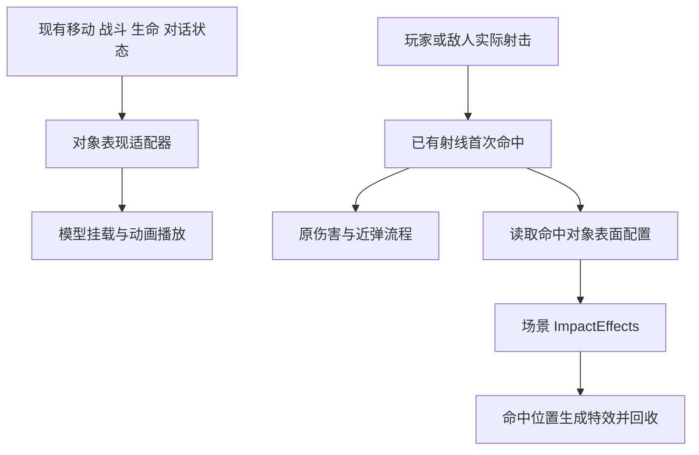

# 模型动画与命中特效接口设计

日期：2026-09-30

状态：设计草案，待用户审阅。本文约定接入方式、兼容边界和验收标准，尚未实现运行代码。

为玩家、敌人、NPC 和掩体添加可配置的模型与动画入口，并为双方子弹命中提供共用特效接口。采用独立表现组件，由现有玩法状态驱动；模型素材可以后续替换，未配置素材时保持当前演示可用。

## 用户目标与维护依据

用户要求保留原有代码和项目结构，按 Markdown 维护指示扩展。命中特效需要覆盖子弹打中掩体的粒子效果，同时具备扩展到其他物体的能力。本次授权范围为制定方案。

维护依据为 [项目目录结构](../../project-layout.md)、[敌人维护协议](../../enemy-ai.md#维护协议)、[敌人测试](../../enemy-tests.md)、[弹药说明](../../gameplay/AMMO.md) 与 [待办](../../TODO.md)。历史记录与现行实现冲突时，以现行维护说明及实际调用链核对结果为准。

约束如下：

- 保留场景入口、已有节点路径、脚本名称及 UID；通过新增子节点和小范围事件通知接入。
- 运行代码按职责放入现有 scripts 分类，场景与资源按用途归档，测试留在 tests。
- 保留工作区已有的 enemy.tscn、ranged.tres、arena.tres 修改，实施时从当时的工作区内容增量修改。
- 玩法数值、AI 评分、战术装配、碰撞层、导航和弹道判定由原组件继续管理。
- 配置资源可复用；播放进度、特效实例、事件连接和复位状态属于每个运行实例。

## 当前接入基础

| 对象或流程 | 当前情况 | 设计影响 |
| --- | --- | --- |
| 玩家 | main.tscn 中已有 Player/Visual/Body；player.gd 的 visual 变量实际指向玩家根节点 | 沿用根节点转向，只在 Visual 下添加模型挂点，不因变量名称改变运动方式 |
| 玩家战斗 | player_combat_v3.gd 提供 shot_fired、weapon_changed；换弹状态在 Ammo 中 | 复用既有事件和真实进度，保持旧信号签名 |
| 玩家死亡 | Health 立即暂停场景树并显示死亡界面 | 仅死亡表现允许在暂停中完成，游戏仍保持暂停 |
| 敌人 | enemy.tscn 独立复用；身体直接操作 Body 的倒地 Tween，并有 reset_completed | 模型接入要同时覆盖死亡和复位，AI 无需知道模型或动画名称 |
| NPC | main.tscn 内有 NPC 与 NPCB；npc.gd 等玩家转身后调用 DialogueUI | 增加带交互来源的对话生命周期通知，避免两个 NPC 同时播放交谈 |
| 掩体 | cover.tscn 使用 BoxShape3D；区域查询依赖 CollisionShape3D 的尺寸和变换 | 模型只能修改自身挂点变换，保留碰撞盒和区域计算 |
| 实际射击 | 玩家 shoot 与敌人 try_fire 使用射线取得首次碰撞，再结算伤害 | 命中特效复用同一次射线结果；感知及瞄准查询不触发特效 |

## 方案选择

| 方案 | 优点 | 代价 |
| --- | --- | --- |
| 各主体脚本直接管理模型和特效 | 初期文件少 | 双方射击重复特效代码，素材路径侵入移动和 AI 身体代码 |
| 独立表现组件与对象表面配置 | 复用接口，兼容已有节点，素材可独立替换 | 需要小型适配脚本和明确的生命周期 |
| 重做角色基类与统一战斗框架 | 长期抽象统一 | 改动范围大，超出本次保留结构的要求 |

采用第二种。首版实现通用模型挂载、AnimationPlayer 播放后端、四类对象适配和命中特效播放。AnimationTree 保留替换后端的协议，具体骨骼分层与混合树随素材接入，不预建一套假定骨骼结构的系统。

## 组件与数据流



VisualPresentation 负责模型实例、占位外观切换和动画后端；玩家、敌人、NPC 的适配器负责把各自的现有状态转换为表现输入。掩体使用通用静态表现组件即可。ImpactReceiver 是命中对象的配置入口，ImpactEffects 是场景共用的播放服务。

这些组件都是可选依赖。缺少表现组件、特效管理器或素材时，玩法继续运行；配置不合法只在加载或配置改变时提示一次。

## 模型挂载与素材约定

建议节点增量如下；所有列出的原有节点保持原路径。

```text
Player
├── Visual                         已有
│   ├── Body                       已有占位外观
│   ├── FrontMarker                已有
│   └── Presentation               新增，挂载模型
├── PlayerPresentation             新增，状态适配
└── ImpactReceiver                 新增，可选表面配置

Enemy
├── Body / FrontMarker / AI / ...  已有
├── Presentation                   新增，挂载模型
├── EnemyPresentation              新增，状态适配
└── ImpactReceiver                 新增

NPC 或 NPCB
├── Body / InteractionArea / ...   已有
├── Presentation                   新增，挂载模型
├── NpcPresentation                新增，状态适配
└── ImpactReceiver                 新增，可选

Cover
├── Mesh / CollisionShape3D        已有
├── Presentation                   新增，挂载模型
└── ImpactReceiver                 新增

Main
└── ImpactEffects                  新增，管理瞬时命中特效
```

Presentation 暴露模型 PackedScene、局部偏移、旋转、缩放、动画播放器路径和动画配置资源。路径相对于实例化的模型根节点，不要求素材中播放器必须固定命名。模型使用 Node3D 根节点，角色包装场景约定脚底为原点、朝向 -Z、Y 轴向上，来源不一致时由包装场景或挂点补偿。掩体挂点相对于当前掩体根节点配置，不假定其原点在地面。

成功实例化模型后才隐藏配置的占位 Mesh 列表。加载失败继续显示占位外观，禁止隐藏主体根节点。FrontMarker 作为兼容节点保留，模型启用时隐藏，复位后重新应用外观可见性策略。

模型包装场景只承载表现，不额外生成阻挡身体、交互区域或自动导航几何。编辑器接入时校验并拒绝意外的物理节点；默认不将模型细节用于导航烘焙，仍沿用既有碰撞几何。第一版提供编辑器模型预览，预览实例不写回原模型文件，也不重复序列化进游戏场景。

不强制提取当前内嵌的玩家或 NPC 为新场景，不迁移已有地图布局。新增素材放 resources/models/，可复用的模型包装场景放 scenes/presentation/。

## 动画接口与状态规则

以下为拟定接口，不代表当前已存在的方法：

| 接口 | 用途 |
| --- | --- |
| apply_state(state) | 更新连续状态：局部实际移动速度、瞄准、对话、死亡、当前武器、换弹状态和归一化进度 |
| play_event(event_id) | 响应实际开火、有效受击等一次性事件，不按帧重播 |
| reset_presentation() | 停止一次性动作，清理队列和插值，恢复挂点初始变换并重新同步状态 |

state 使用专用的轻量运行数据类型，字段固定，不作为任意玩法数据的容器。动画配置仅保存状态到动画名称的映射、过渡时间和移动播放倍率范围，运行状态不写回共享 Resource。

| 对象 | 首版语义状态 |
| --- | --- |
| 玩家 | idle、move、sprint、aim、reload、dialogue、dead，以及 fire、hit 事件 |
| 敌人 | idle、move、aim、reload、dead，以及 fire、hit 事件 |
| NPC | idle、dialogue，可选 talk 事件 |
| 掩体 | idle，可选 impact 事件；destroyed 仅保留语义扩展点 |

移动读实际水平位移或实际速度，转换到身体局部方向，避免顶墙时持续走路；传送、离场复位及首次挂载重置采样基准。锁定横移传递移动方向，首版可映射为单一移动动画，素材提供前后左右动作后由后端扩展。

简单播放器后端按死亡、对话、换弹、一次性事件、移动或瞄准待机选择表现。死亡清理其他动作，受击不会取消真实换弹；换弹期间的 hit 可跳过以保持进度对应。fire 只在真实消耗弹药且完成发射时触发，自动射击允许每发重新触发表现，表现不限制射速。一次性动作结束后回到当时的连续状态，持续状态不每帧从头播放。

动画缺失时采用明确回退：sprint 回退 move，aim 和 dialogue 回退 idle；fire 和 hit 缺失时跳过；reload 缺失时保持可用基础姿态；idle 也缺失时保留模型默认姿态。死亡单独按下节处理。

首版使用原地动画，动画轨道不得修改玩法根节点、碰撞体、弹药或生命值。动画事件轨道不执行伤害或补弹。AnimationTree 后端未来消费同一状态和事件协议，并独占对应播放器控制；同时运行两种后端属于无效配置。上半身混合、IK、根运动和骨骼重定向不在首版接口验收内。

### 换弹与武器切换

换弹播放位置由当前 Ammo 的 reload_progress 驱动，映射到素材片段的归一化时间；动画结束不能提前补弹。这样支持玩家快慢方式、50%阶段暂停、取消后重新开始、切槽保留阶段及敌人固定时长。

暂停续换时退出活动换弹表现，保留的阶段仍在原 Ammo 中；恢复时从真实进度定位。weapon_changed 后重新绑定当前武器状态，不能继续推进收起武器的动画。只同步姿态时间，不用时间跳转补发动画事件。敌人战术切换期间 Ammo 仍在换弹时，动画继续播放，不根据战术名字判断换弹结束。

### 死亡与复位

敌人受击后先完成现有死亡状态和碰撞清理，再通知表现层。配置有效死亡动画时播放并保持最后姿态；未配置模型时保留原 Body 倒地 Tween；有模型但无死亡动画时对模型挂点执行等价倒地回退。三种路径互斥，不能同一模型叠加 Tween 与动画。

reset_target 继续负责身体、弹药、碰撞和导航复位，reset_completed 触发表现复位。原有 Body 引用和默认占位回归保持有效；模型动画、回退 Tween、一次性动作与 FrontMarker 可见性一起恢复。

玩家 Health 增加结算后的生命变化或死亡通知，保留原 hit_received 签名与无敌时的准度干扰语义。受伤动画以实际生命损失触发；子弹碰撞特效不受无敌开关影响。死亡时仍立即暂停游戏并展示界面，仅该玩家的表现分支临时允许死亡动画或倒地回退继续更新；完成后保持姿态，禁止其他移动或特效借此继续运行。重新加载场景自然清理该状态。

### 对话生命周期

DialogueUI 增加对话开始和结束通知，携带交互来源 NPC。现有 open_dialogue 三参数调用继续可用，新增来源参数可选；npc.gd 显式传入自身。

适配器只响应自身发起的会话。等待玩家转身时 NPC 保持待机，UI 真正打开后进入 dialogue，结束后恢复 idle。talk 表示循环交谈姿态，不承诺口型或逐句发言者识别。关闭、替换、来源移除与场景退出清理当前会话；异步读台词使用会话标识，旧请求完成后不得重新打开已结束会话。剧情选项与 Dialogue Manager 资源不调整。

## 子弹命中特效接口

### 责任划分

ImpactReceiver 挂在物理碰撞对象下，保存 enabled 和表面特效配置。它不检测子弹、不发射射线、不扣血，也不要求对象属于 combat_target。金属、石头、木头等表面通过显式资源选择，首版不根据模型材质名称自动推断。

ImpactEffects 为可复用 Node3D 场景组件，主场景放一个；单独运行的战斗场景可以配置自己的实例。射击方通过显式引用或向上查找最近祖先的直接 ImpactEffects 子节点取得服务，不从全场景分组随意选第一个。缺少服务时忽略表现请求，保留全部战斗结果。

命中碰撞体的直接 ImpactReceiver 是配置入口，首版不跨父链猜测属于谁，模型包装场景禁止额外碰撞体。未配置 Receiver 或 profile 时使用管理器的可选默认配置；enabled=false 明确禁止该对象的命中特效，不再回退默认。

### 命中数据与调用顺序

拟定入口分为 capture_hit(hit_result, shot_direction, source) 与 dispatch_impact(event)，仅由两处真实射击出口成对调用。前者在伤害结算前快照为一次性的 ImpactEvent，后者在结算后消费快照并调用内部 play_impact(event, profile)。不将伤害回调传给特效管理器。

ImpactEvent 保存世界坐标命中点、表面法线、入射方向、碰撞体及来源的弱引用、所属区域弱引用，并在即时解析时保留 profile 引用。每个事件只允许派发一次，消费标记保存在该事件实例；无有效命中时 capture_hit 返回空。首版不增加弹丸种类或伤害缩放特效等尚无消费者的字段。

每次实际射击的顺序为：

1. 复用原射线结果；没有碰撞则不创建命中特效。
2. 在调用 receive_hit 前快照命中点、法线、表面配置和区域，避免目标因死亡移除后无法解析。
3. 沿用原伤害、准度、弹药、噪声、近弹和弹道线流程，不改变结算顺序。
4. 对快照派发一次命中特效请求；对象已释放也可在世界命中位置完成瞬时效果。

命中墙体同样会走第4步，不能嵌套在 combat_target 或 player 的伤害分支里。不得从共用射线查询函数、瞄准、感知、Utility 评估或 receive_hit 再次派发，避免虚假效果及重复播放。shot_fired 原有布尔值表示是否命中战斗目标，不能拿它判断是否撞墙。

### 特效素材与回收

ImpactProfile 首版暴露 effect_scene、surface_offset 和 max_lifetime。effect_scene 为带根控制脚本的 Node3D 场景，初始化接收 ImpactEvent，完成时发出 finished；管理器在完成或到达最大寿命时释放。特效场景可包含一次性粒子、光照和短暂网格。撞击音效与贴花以后使用同一事件扩展，首版不加入无效检查器字段。

特效包装根节点约定 +Y 指向表面外侧。位置沿法线偏移少量距离，朝向构造需要处理水平面和垂直面；射线从物体内部发出可能没有有效法线，此时使用入射反方向回退。只修正表现朝向，不改变实际命中点和弹道。随机外观使用独立随机源，不消耗现有射击或 AI 随机序列。

瞬时火花和烟尘实例放在 ImpactEffects 下，保留世界变换，不随被击中物体倒地或删除。后续若加入弹孔，需另行实现局部坐标附着和目标失效清理；不把普通粒子强制挂到目标身上。

拟定管理器默认最多64个活动实例，可在检查器调整；达到上限先回收最早实例。首版使用实例化和释放，不预建对象池；数量上限与超时回收是验收要求，64是初始配置而非性能承诺。暂停时粒子与寿命一起暂停，场景卸载全部释放。

区域复位时仅清理对应区域的效果。区域控制脚本增加带自身来源的复位通知；事件所属区域以命中对象所在区域优先，来源所在区域次之，否则归属当前场景。管理器对有效区域建立一次连接，区域释放或对应通知发生时清理其记录，不影响其他区域。

掩体可选的 impact 动画与粒子共用这一实际命中通知，由 ImpactReceiver 转交同主体的 Presentation 播放一次，无需另设掩体适配脚本。粒子配置为空时仍可通知有效的表现组件；enabled=false 则跳过该 Receiver 的粒子和动画通知。即使达到粒子数量上限，也不影响伤害。destroyed 接口仅保留扩展约定，当前不增加掩体血量、破坏状态、碰撞变化或导航重建。

## 文件安排与修改边界

以下是拟定文件位置，可在实施计划中合并只有单一用途的小型辅助类型；不迁移现有文件。

| 位置 | 内容 |
| --- | --- |
| scripts/systems/presentation/ | visual_presentation.gd、animation_profile.gd、presentation_state.gd、默认动画后端 |
| scripts/systems/effects/ | impact_receiver.gd、impact_effects.gd、impact_profile.gd、impact_event.gd、特效根脚本 |
| scripts/player/player_presentation.gd | 玩家状态与事件适配 |
| scripts/enemy/enemy_presentation.gd | 敌人身体状态、实际开火和复位适配 |
| scripts/world/npc_presentation.gd | NPC 会话适配 |
| scenes/presentation/、resources/models/、resources/animations/ | 模型包装场景、模型素材、动画映射配置 |
| scenes/effects/、resources/effects/ | 共用管理器、粒子场景和表面配置 |
| tests/、tests/enemy/ | 表现与特效协议测试，敌人生命周期测试 |
| docs/gameplay/PRESENTATION.md | 实施完成后添加的美术接入与维护说明 |

现有文件的预期修改限于：

- player_combat_v3.gd 与 enemy_actor.gd：实际命中派发；敌人新增实际开火和死亡通知，默认死亡回退保留。
- player_health.gd：结算后的生命变化或死亡通知；死亡暂停与重开行为保持。
- npc.gd、dialogue_ui.gd：会话来源和生命周期通知。
- shooting_range.gd：区域复位通知，供特效清理。
- main.tscn、enemy.tscn、cover.tscn：新增可选表现节点和配置；其他直接运行场景按实际测试需要补充服务。
- 项目目录说明和专项文档：说明新增职责、素材约定、默认回退及验证入口。

状态采样优先在适配器内完成，避免给原玩家移动代码增加动画分支。Enemy AI、动作库、评分器、Training、UnitType、武器数值和第三方插件不承担新表现职责。

## 分阶段交付

1. 通用模型挂载和默认动画后端，验证空配置、缺失资源、编辑器保存及多个实例隔离。
2. 玩家和敌人接入，覆盖实际移动、开火、换弹、死亡、暂停和复位。
3. NPC 与掩体接入，覆盖会话归属、静态模型对齐和缺省回退。
4. 双方真实命中出口接入 ImpactReceiver 与 ImpactEffects，提供最小粒子示例和表面配置示例。
5. 执行相关回归与窗口内检查，补齐接入文档，记录实际素材未提供时的验证范围。

测试素材使用简单网格和可观察动画轨道即可验证接口，不要求先制作正式人物。正式模型、骨骼和动画资产的制作及视觉品质验收需在素材接入后完成。

## 验收标准

| 范围 | 必须验证的行为 |
| --- | --- |
| 默认兼容 | 四类对象都不配置模型或动画时可运行；旧节点路径与场景引用有效 |
| 模型配置 | 尺寸、朝向、偏移可保存重载；编辑器预览不重复保存；加载失败保留占位外观 |
| 移动与瞄准 | 原移动轨迹和身体朝向不变，顶墙不假走，锁定横移不误判为静止 |
| 开火 | 玩家和敌人每次实际发射触发一次；空匣、冷却或瞄准查询不触发 |
| 换弹 | 快慢模式、50%前取消、半程暂停、切槽续换和敌人跨战术续换均跟随实际进度 |
| 死亡与复位 | 玩家暂停中仅死亡表现完成；敌人模型死亡与默认回退互斥；离场及重开无残留姿态 |
| NPC | NPC 与 NPCB 只响应各自会话；正常结束、替换、异步返回和来源移除不残留交谈 |
| 命中粒子 | 双方打中掩体都播放；首个碰撞物阻挡后，墙后不播放；未命中不播放 |
| 表面配置 | 不同对象使用各自资源；默认配置、显式禁用和缺少管理器的语义正确 |
| 特效几何 | 墙面、地面、旋转掩体及无有效法线时方向正确；目标删除后瞬时粒子仍可完成 |
| 生命周期 | 完成与超时释放、数量上限、暂停、局部区域复位和场景重开均正确 |
| 多实例 | 共用资源的角色播放进度独立；同一射击不会因多个管理器重复生成 |
| 玩法隔离 | 表现随机源不改变弹道与 AI 决策；关闭全部表现后战斗与导航结果保持 |

实施后按 [敌人测试](../../enemy-tests.md) 运行敌人和战斗回归入口，并补充移动、交互、掩体实例保存及新增表现专项。涉及核心射击和死亡流程，因此不能只验证粒子是否出现。测试失败需区分既有工作区问题与本次引入问题，不覆盖现有调参来通过测试。

窗口内验证粒子可见性、模型穿插、方向、动画衔接和暂停效果；无窗口测试用于逻辑与生命周期，不能代替视觉确认。本轮仅检查设计文档与现有代码的对应关系，不声称上述运行验收已经通过。

## 实施前审阅范围

请审阅本方案是否符合预期，重点是首版采用原地动画、简单播放器后端、表面配置与共用特效服务，以及高级动画混合和可破坏掩体留待后续。确认设计后再编写逐文件实施计划，本次文档不直接授权修改运行代码。
